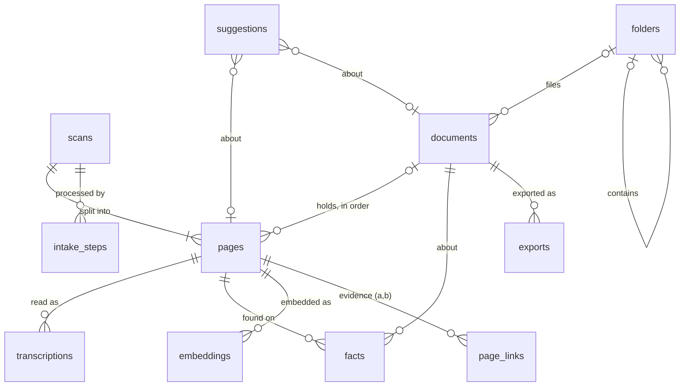

# Lindley database design

Schema version 1. The source of truth is [backend/src/lindley/db/schema.sql](../backend/src/lindley/db/schema.sql).
This document explains why the schema is shaped the way it is.

## Goals

1. **Intake keeps everything that could help match pages.** Each incoming file is squeezed for every clue it holds: what the file says about itself, what the image looks like, what the text says. All of it is kept with its source and confidence.
2. **Records fill in over time.** A document starts as a few pages and a guessed name. It gets closer to complete as pages are read, reviewed, dated and named. Completeness is worked out from the data, so it can never drift out of step.
3. **Nothing is destroyed.** Originals are never altered, and pages and readings are never deleted. A person's correction is added as a new reading.
4. **Every page is in one place.** A page is in the Inbox, in a document, or Set aside, and the database enforces it.
5. **Lindley suggests and people decide.** Anything Lindley proposes is stored as a suggestion, with its reasons, until a person accepts or dismisses it.

## Entities



| Table | One row per | Why it exists |
|---|---|---|
| `scans` | incoming file | Where the file came from, its hash (to catch duplicates), EXIF data and import mode. A multi-page PDF or TIFF is one scan. |
| `pages` | page image | The unit people move around. Holds the image measurements and where the page lives (a document and position, Set aside, or neither, which means the Inbox). |
| `transcriptions` | reading of a page | Every reading from Tesseract, the vision model, or a person's correction. Exactly one is current. `confirmed_at` records that a person checked it. |
| `facts` | thing found | Dates, names, places, letterheads and so on, each with a source, a confidence, and its position on the page. Belongs to a page or to a document. |
| `embeddings` | page and model | A text vector for "related pages" and similarity matching. |
| `page_links` | page pair and relation | Evidence that two pages belong together, such as "continues", "same paper", or "adjacent file". |
| `documents` | document | Name (and whether a person chose it), status, folder, type, date, grouping confidence, summary. |
| `folders` | folder | The user's folder tree. |
| `suggestions` | proposal | "Add to document", "reorder", "name", "complete", and so on, with reasons shown in the UI. |
| `exports` | PDF made | When a document was exported, where to, and which pages were in it. |
| `intake_steps` | step run | Progress, errors, and the extractor version for each step, so a step can be re-run later. |
| `history` | action | Who did what (a person or Lindley), with before and after. Used for undo and the audit trail. |

Settings stay in `settings.json`. API keys stay in Windows Credential Manager and never go in the database.

## What intake extracts

Each step writes an `intake_steps` row, so the UI can show "Reading…" and a failed step can be retried alone.

| Step | Reads | Writes |
|---|---|---|
| `hash` | the file | `scans.sha256`. A known hash is flagged as a duplicate rather than imported twice. |
| `exif` | file system, EXIF | file created and modified times, `scanner_make` and `scanner_model`, `scanned_at`, `exif_json`, and a `file` fact from the file name (`scan_0042` is a sequence number) |
| `split` | PDF or TIFF | one `pages` row per page, with `page_index` |
| `image` | the page image | size, DPI, colour mode, `phash`, `paper_color`, `blank_score`, `detected_rotation`, `script` (handwritten, printed, typed, mixed or none) |
| `ocr` | Tesseract | a `transcriptions` row with word boxes and confidence, and `language` |
| `vision` | vision model | a `transcriptions` row for handwriting and low-confidence pages. It becomes current if it's the better reading. |
| `facts` | current text, image | `facts` rows (see below) |
| `embed` | current text | an `embeddings` row |
| `match` | everything above | `page_links` evidence, then `suggestions` |

### Kinds of fact

These are the starting kinds. New extractors add new kinds without a schema change.

| Kind | Example | Helps with |
|---|---|---|
| `date` | "March 4th 1892", normalized to `1892-03-04` | document date, ordering, matching |
| `person`, `place`, `organization` | "John Branson", "Xenia, O." | shared-name matching and search |
| `amount` | "3.50" | receipts and deeds |
| `salutation`, `closing`, `signature_name` | "Dear Sister,", "Your loving son", "Will" | where a letter starts and ends, and who wrote it |
| `letterhead`, `heading` | "XENIA FEED & SEED CO." | same-letterhead matching and document type |
| `page_marker` | "- 2 -" | page order |
| `first_line`, `last_line` | the opening and closing text | joining a sentence that runs from one page onto the next |
| `ink_color`, `stamp_seal` | "brown ink", "county seal" | same writer or sitting, and document type |
| `reference_number` | "Book 12, p. 340" | deeds and legal records |
| `document_type_hint` | "letter" | document type |

Each fact records `source` (file, exif, image, ocr, vision, rule or user), `source_detail` (the extractor and its version), `confidence`, `bbox` (so the UI can highlight it on the scan), and `status` (proposed, accepted or rejected). When a person corrects a fact, a new `user` fact is added and the old one is rejected. Nothing is overwritten.

## How matching works

```
facts, embeddings, image data  ->  page_links (evidence, one row per signal)
                               ->  suggestions (one proposal, with reasons)
                               ->  a person accepts or dismisses it  ->  history
```

- **Evidence is stored before any decision is made.** Every signal is stored in `page_links` separately, with a score and a readable `evidence` note, for example: "Page 2 ends mid-sentence ('…the auction in'); page 3 begins 'May, and Father…'".
- **The matcher combines the signals into one suggestion.** Its `reasons` are the plain-language list shown in the UI, for example "Same handwriting as page 2", "Mentions Mary and the auction in May".
- **Lindley's own groupings are ordinary rows.** When Lindley groups pages on its own (the italic, suggested names in the mockup), it creates a document with `origin = 'lindley'` and `name_source = 'lindley'`. Everything stays visible and can be undone through `history`.

## Completeness

`lindley.db.progress.document_progress(conn, doc_id, review_below)` works out a checklist every time it's asked. Nothing is stored.

| Check | Done when |
|---|---|
| Has pages | the document holds at least one page |
| Every page read | every page's scan is read and has a current reading |
| Nothing waiting for review | no current reading is below the review threshold without being corrected or confirmed by a person |
| Named | `name_source = 'user'`, meaning a person chose or accepted the name |
| Date known | `doc_date` is set (partial dates like `1892-03` count) |
| Type known | `doc_type` is set |
| Page order settled | no open `reorder` suggestion |
| Exported | an `exports` row exists |

`ready` means everything except the export is done. That drives the mockup's banner, "Lindley thinks this document is complete." The review threshold comes from settings, so it's passed in rather than stored. Changing the threshold changes the checklist straight away.

## The Details tab (future UI round)

The Details tab reads directly from this data:

- **Page:** file and scanner information (`scans`), image measurements (`pages`), every reading with its source and confidence (`transcriptions`), and facts grouped by kind, each with a "found by" label and a highlight on the scan.
- **Document:** the completeness checklist, document facts, the evidence that holds the pages together (`page_links` between its pages), open suggestions with their reasons, and export history.

## Rules the schema enforces

- A page can't be both in a document and Set aside. A page in a document must have a position.
- A document that still holds pages can't be deleted, and neither can pages, readings or scans. Foreign keys have no cascade.
- Each page has at most one current reading (a partial unique index).
- A fact belongs to exactly one page or one document.
- A page link is stored once per pair, relation and source, with the smaller page id first.
- Searches go through `transcriptions_fts` joined on `is_current = 1`, so old readings aren't matched but are kept.

## Versioning

`PRAGMA user_version` holds the schema version (`SCHEMA_VERSION` in `database.py`). New databases are built from `schema.sql`. Existing ones run the numbered `MIGRATIONS` in order. A database from before version 1 (the placeholder tables) is rebuilt if it's empty, and refused with an explanation if it has data.

## Ask Lindley's view of the data

The AI gets read-only access through views, currently `v_page_location` and `v_current_text`, plus tools built on them. It never writes. Anything it wants to change becomes a suggestion for a person to decide.
