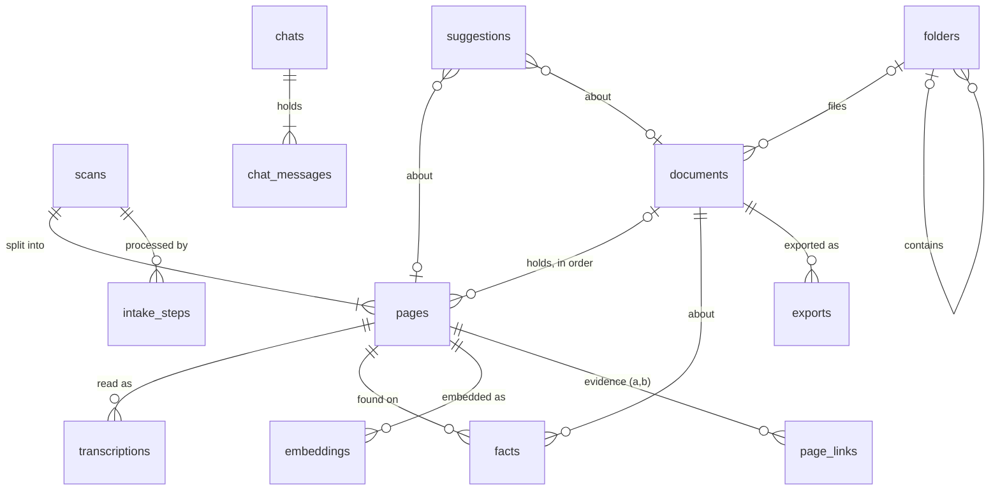

# Lindley database design

Schema version 14. The source of truth is [backend/src/lindley/db/schema.sql](../backend/src/lindley/db/schema.sql).
This document explains why the schema is shaped the way it is.

## Goals

1. **Intake keeps everything that could help match pages.** Each incoming file is squeezed for every clue it holds: what the file says about itself, what the image looks like, what the text says. All of it is kept with its source and confidence.
2. **Records fill in over time.** A document starts as a few pages and a guessed name. It gets closer to complete as pages are read, reviewed, dated and named. Completeness is worked out from the data, so it can never drift out of step.
3. **Nothing is destroyed.** Originals are never altered, and pages and readings are never deleted. A person's correction is added as a new reading.
4. **Every page is in one place.** A page is in the Inbox, in a document, or Set aside, and the database enforces it.
5. **Lindley suggests and people decide.** Anything Lindley proposes is stored as a suggestion, with its reasons, until a person accepts or dismisses it.

## Entities



| Table | One row per | Why it exists |
|---|---|---|
| `scans` | incoming file | Where the file came from, its hash (to catch duplicates), EXIF data and import mode. A multi-page PDF or TIFF is one scan. |
| `pages` | page image | The unit people move around. Holds the image measurements and where the page lives (a document and position, Set aside, or neither, which means the Inbox). |
| `transcriptions` | reading of a page | Every reading from Tesseract, the vision model, or a person's correction. Exactly one is current. `confirmed_at` records that a person checked it. |
| `facts` | thing found | Dates, names, places, letterheads and so on, each with a source, a confidence, and its position on the page. Belongs to a page or to a document. |
| `embeddings` | page and model | A text vector for "related pages" and similarity matching. |
| `page_links` | page pair and relation | Evidence that two pages belong together, such as "continues", "same paper", or "adjacent file". |
| `documents` | document | Name (and whether a person chose it), status, folder, type, date, grouping confidence, summary. |
| `folders` | folder | The user's folder tree. |
| `suggestions` | proposal | "Add to document", "reorder", "name", "complete", and so on, with reasons shown in the UI. |
| `exports` | PDF made | When a document was exported, where to, and which pages were in it. |
| `intake_steps` | step run | Progress, errors, and the extractor version for each step, so a step can be re-run later. |
| `seen_files` | file in a watched folder | Its path, size, time and hash, so the start-up sweep needn't hash a file it has met before. |
| `history` | action | Who did what (a person or Lindley), with before and after. A person's decision is one `batch` of rows, undone together. Used for undo and the audit trail. |
| `duplicates` | page pair | Two pages that look like the same page scanned again (`same_page`), or that have very similar text (`similar`), with the evidence and a person's decision. |
| `duplicate_checks`, `text_sketch` | page | Which reading each page was checked for duplicates with, and the page's text sketch for finding candidates. |
| `ai_calls` | call to an AI | Which connection, what for (reading a page, sorting pages), whether Lindley made it on its own or a person OKed it, whether it worked, and, when the AI says, the model, tokens sent and written, and an estimated cost (`providers/prices.py`, list prices; the bill is the real figure). Every connector says what a call used, before it checks the answer: one cut off or refused is charged too. Prices are by model id, a dated snapshot priced as its model; each company's own price for writing to its cache; a prompt over OpenAI's 272K tokens or Gemini Pro's 200K priced long for the whole call; and prices that change on a date (Gemini Flash in 2027) taken on the day of the call. A local AI's calls have tokens and no cost. Keeps the daily and monthly limits (calls that worked), notices an AI whose calls keep failing, and shows what was sent where. |
| `ai_answers` | question to an AI | The AI's reply about some pages, known by what it was shown, so the same question is never paid for twice. |
| `chats`, `chat_messages` | conversation, and question or answer | Ask Lindley's conversations, kept until a person deletes one. An answer keeps the pages sent with its question (`sources`, as `[n]` in its text), whether it finished, was stopped or failed, and which AI wrote it. |
| `needs_ai` | question waiting for an AI | Pages the rules couldn't sort and the AI hasn't been asked about, with the rules' own guess at the documents in them. Refreshed each time the assembler runs. |

Settings stay in `settings.json`. API keys stay in Windows Credential Manager and never go in the database.

## What intake extracts

Each step writes an `intake_steps` row, so the UI can show "Reading…" and a failed step can be retried alone. Steps left `running` when Lindley closed are picked up at start-up: a vision call goes back in the queue; a one-off check of a page read before (upside down, mirror image) goes back once, and is marked failed if it's cut off again, in case that page is what stops Lindley; any other step is marked failed, and each watcher start reads scans whose reading never finished, from Lindley's own copy. Work files a cut-off reading left (turned page copies in the processing folder, Tesseract's `lindley-ocr-*` temp folders) are removed at start-up once they're an hour old.

| Step | Reads | Writes |
|---|---|---|
| `hash` | the file | `scans.sha256`. A known hash is flagged as a duplicate rather than imported twice. |
| `exif` | file system, EXIF | file created and modified times, `scanner_make` and `scanner_model`, `scanned_at`, `exif_json`, and a `file` fact from the file name (`scan_0042` is a sequence number) |
| `split` | PDF or TIFF | one `pages` row per page, with `page_index` |
| `image` | the page image | size, DPI, colour mode, `phash`, `paper_color`, `blank_score`, `detected_rotation`, `script` (handwritten, printed, typed, mixed or none) |
| `ocr` | Tesseract | a `transcriptions` row with word boxes and confidence, and `language` |
| `vision` | vision model | a `transcriptions` row for handwriting and low-confidence pages. It becomes current if it's the better reading, but never replaces a person's text. With `vision_mode = ask` (the default), the step is first recorded as `queued` ("Waiting for you to OK the vision model") and runs only when a person sends the waiting pages (`Pipeline.read_waiting`). A failed call is never repeated on its own, and after 3 automatic calls in a row fail, the AI is left alone for 15 minutes while new pages wait. |
| `facts` | current text, image | `facts` rows (see below) |
| `embed` | current text | an `embeddings` row |
| `match` | everything above | `page_links` evidence, then `suggestions` |

### The image step

`lindley.worker.image` looks at a reduced copy of each page with its edges cropped off, so dark
scanner borders and shadows don't count as writing. The thresholds are a first guess, to be tuned
on real scans.

- `blank_score` is how little ink there is, after dust specks are filtered out: 0 means a full
  page of writing and 1 means blank. At 0.97 or above, a page counts as blank. A blank page
  is still read by Tesseract, so it has a current reading, but it isn't sent to the vision model
  and the assembler only suggests setting it aside.
- `paper_color` is the mean colour of the background pixels.
- `phash` is a 64-bit difference hash. Hashes within 4 bits of each other are the same picture
  (a `duplicate` link). Near-empty pages all hash alike, so they're never compared.
- `detected_rotation` is the degrees clockwise that turn the page upright. Tesseract finds it as
  it reads the page, in one run (`--psm 1`, about 25% quicker than an orientation check
  followed by a reading), and says so in its hOCR (`textangle`). It only turns a page it's sure
  of. An upside-down page's word boxes are turned back with it; a sideways page is read again
  from an upright copy, since Tesseract reads its lines as vertical. A page it didn't turn but
  that reads poorly may still be the wrong way up: its orientation check (`--psm 0`) is asked
  for a guess, which on real scans was as often wrong as right, so the page is also read
  turned that way, and the turn kept only if that reads at least 10 points better. When the
  check says the page is upright, the guess is upside down: on typed pages lying upside down
  on the scanner it said "0 degrees", once at confidence 4.3. Of 344 real scans, 4 such pages
  read at 19–27 as they were (taken for handwriting, and left waiting for the vision model) and
  at 56–79 turned, while pages that were upright fell to 25–35. Pages read before this was
  tried are queued once by the upgrade to schema 10 and checked the same way when the watcher
  starts (`Pipeline.check_upside_down`); a page a person checked, turned or completed is left
  alone. On that library it checked 44 pages in 157 seconds and turned those 4. A turn a
  person set (`user_rotation`) is trusted and not looked for again. A page only the vision
  model reads gets the orientation check alone, and is turned when Tesseract is sure (2 or
  more). Pages with
  `detected_rotation + user_rotation` (or an EXIF orientation) are read from a turned copy in the
  processing folder, which is deleted afterwards. **Word boxes are therefore in upright
  coordinates.** `width_px` and `height_px` are the image as a viewer shows it (EXIF applied),
  before either rotation.
- `detected_mirror` and `user_mirror` (schema 12): the page is a **mirror image**, the back of
  a carbon copy or a page scanned through the paper, when one of them is set but not both. It's
  turned round left to right before `detected_rotation + user_rotation`
  (`image.upright_page`), wherever the page is read, shown, exported or compared. A page that
  still reads poorly after the turns above is read turned round (`Pipeline._try_mirroring`,
  Tesseract's `mirrored_reading`), and if that doesn't read well, upside down too. The mirror
  is kept only if that reads at least 10 points better *and* well (`ocr.confidence_threshold`).
  On the dev library's 409 scans, the two mirror images read at 37–42 as they were and 85–88
  turned round, matching Claude's readings at 95–96%. One was upside down as well. Pages the
  right way round read at 25–35 turned round. A page of handwriting Tesseract can't read either
  way went from 21 to 51, clearly better but not well, and that's why reading well is required
  too. Pages read before are queued once by the upgrade to schema 12 and checked when the
  watcher starts (`Pipeline.check_mirrored`): 49 pages in about 5 minutes. A mirror image
  found there is turned round to show and export even if an AI or a person read it since. Its
  new reading is used only in place of Tesseract's own. A person can flip any page left to
  right (`user_mirror`, undoable), which is trusted, as a turn is.
- **A page a person turns or flips is read again.** Each Tesseract reading notes how the page
  was turned when it was made (`read_rotation`, `read_mirror`, schema 13). A page whose latest
  Tesseract reading was made turned another way than the page is now
  (`pipeline.turned_since_read`) is read again that way by the watcher, within a second or so
  (`Pipeline.read_turned_again`). Undoing a turn is a turn too, and several turns one after
  another are read once. The new reading is used in place of Tesseract's own, and of an AI's
  that reads worse (`_preference`), never in place of a person's text or one they checked;
  it's kept beside those. A page turned again while it was being read keeps that reading beside
  its own and is read again. Blank pages and pages in a completed document are left, as is a
  page whose reading again failed (Tesseract missing, say) until it's turned again. Inbox pages
  read again are sorted again once things settle; the status bar counts the pages waiting
  ("Reading 1 turned page again"). A reading made before schema 13 isn't known to be turned
  any way: it's read again if a person turned the page, once.
- `script` is set after reading, from Tesseract's confidence line by line. Lines under 50% look
  handwritten and lines at 75% or more look printed; typewriting on old paper often falls in
  between.
  - Mostly handwritten lines (70%) make a page `handwritten`.
  - A real share of both (20% each) makes it `mixed`, such as a typed page with handwritten
    corrections.
  - Otherwise, a page where at least 40% of lines clearly look printed is `printed`.
  - A blank page is `none`.
  - If Tesseract can't tell, it stays NULL. `typed` isn't told apart from `printed` yet.

The step runs once per page. A scan that's read again after a failure doesn't check its pages again.

### Kinds of fact

These are the starting kinds. New extractors add new kinds without a schema change.

| Kind | Example | Helps with |
|---|---|---|
| `date` | "March 4th 1892", normalized to `1892-03-04` | document date, ordering, matching |
| `person`, `place`, `organization` | "John Branson", "Xenia, O." | shared-name matching and search |
| `amount` | "3.50" | receipts and deeds |
| `salutation`, `closing`, `signature_name` | "Dear Sister,", "Your loving son", "Will" | where a letter starts and ends, and who wrote it |
| `dateline` | "Ely, Nevada, June 24, 1940" | where a letter with no greeting starts |
| `letterhead`, `heading` | "XENIA FEED & SEED CO." | same-letterhead matching and document type |
| `page_marker` | "- 2 -" | page order |
| `first_line`, `last_line` | the opening and closing text | joining a sentence that runs from one page onto the next |
| `ink_color`, `stamp_seal` | "brown ink", "county seal" | same writer or sitting, and document type |
| `reference_number` | "Book 12, p. 340" | deeds and legal records |
| `document_type_hint` | "letter" | document type |

Each fact records `source` (file, exif, image, ocr, vision, rule or user), `source_detail` (the extractor and its version), `confidence`, `bbox` (so the UI can highlight it on the scan), and `status` (proposed, accepted or rejected). When a person corrects a fact, a new `user` fact is added and the old one is rejected. Nothing is overwritten.

## How matching works

```
facts, embeddings, image data  ->  page_links (evidence, one row per signal)
                               ->  suggestions (one proposal, with reasons)
                               ->  a person accepts or dismisses it  ->  history
```

- **Evidence is stored before any decision is made.** Every signal is stored in `page_links` separately, with a score and a readable `evidence` note, for example: "Page 2 ends mid-sentence ('…the auction in'); page 3 begins 'May, and Father…'".
- **The matcher combines the signals into one suggestion.** Its `reasons` are the plain-language list shown in the UI, for example "Same handwriting as page 2", "Mentions Mary and the auction in May".
- **Lindley's own groupings are ordinary rows.** When Lindley groups pages on its own (the italic, suggested names in the mockup), it creates a document with `origin = 'lindley'` and `name_source = 'lindley'`. Everything stays visible and can be undone through `history`.

## The assembler: from Inbox pages to documents

`lindley.assembler.assemble(conn, settings.assembler, chat)` runs once new scans have settled. It's safe to run as often as you like; a second run with nothing new changes nothing.

1. **Clues** (`clues.py`, rules only).
   - **Page numbers.** A number on a row of its own in the top or bottom 12% of the page ("- 2 -", "Page 2 of 3", "ii"). Specks and smudges on that row don't count against it, and OCR slips next to a real digit are read through ("1l" is 11). A number inside a sentence, or in a typesetter's note like "Indent 1 em", isn't one. A number read with doubt is marked unsure and counts for less, and never moves a page: creases and specks by the paper's edge are often read as numbers. When every page of a document is numbered, a gap is reported: "Page 4 seems to be missing". The same number twice on a row (typed, and copied beside it in pencil) is that number. Tesseract often drops or garbles a number standing alone, so the reading already holds the margins read again on their own (`worker/ocr/margins.py`, see "Page numbers in the margins").
   - **Noise at the edges.** Lines of specks (the paper's edge, show-through, a hole punch) are dropped from the top and bottom before the first and last lines are taken, and so are stray marks before the first word. A scrap Tesseract read out of order goes back into the line it sits in.
   - greetings ("Dear Sister,", in the first 5 lines, or a short one ending in a comma or colon in the first 15, under a letterhead), letterheads, headings and bylines ("By Lindley C. Branson"), which start a document;
   - date lines: a short line with a full date near the top, with who the letter is to (Honorable, Mr., Mrs., Dear…) or a greeting just below, which starts a letter that has no "Dear". A diary's dated entry has no one under its date. It's looked for before noise is trimmed, since Tesseract can doubt every word of one (see "Confidence bars");
   - closings and signatures ("Your loving son / John"), "Paid" on a short line of its own ("Paid. Thank you.", not "and paid no attention" in a story) and "Notary Public", which end one;
   - sentences cut off at the bottom of a page and picked up at the top of the next;
   - dates in old spellings, people, places, amounts, and file sequence numbers (`scan_0042` is 42). Scanners and file managers often number only the files after the first (Image, Image (2), Image (3) on Windows; Image, Image 2 on a Mac), so a name without a number is number 1 (`clues.file_series`);
   - whether a page looks like a letter, receipt, deed, diary, stray note or blank.

   All of these are saved as `facts` with `source = 'rule'`.
2. **Evidence** (`evidence.py`). Each pair of pages gets a same-document score from 0 to 1. Every piece of evidence is a named feature, and a small logistic model adds up their weights (`weights.py`, in log-odds) into the score:
   - scanned one after another; a greeting on the second page or a signature on the first; different kinds of page;
   - page numbers running n → n+1, close (a page swapped or missing) or far apart;
   - a sentence carried over the break, counted for less between pages not scanned together (in a typescript nearly every page ends mid-sentence);
   - the same letterhead, shared names, the same paper colour;
   - the **layout fingerprint** (`layout.py`): where lines start and end as a share of the page width, line spacing in character widths, and characters in a full line. It's free of the scan's size and resolution. On a flatbed the sheet lies wherever it was put down, so margins shift within a typescript too (on 25 sorted folders, over a third of pages differ from the next by their margins alone), but more often between two: without them, or with twice the leeway, far more typescripts fed in one after another ran into the next. Pages set out differently (a single-spaced letter, a page of 40-character notes) are kept apart;
   - **rare words** both pages use (`terms.py`, tf-idf), measured but not yet counted (see below). How rare a word is is measured over every page in the library, not only the Inbox;
   - a word hyphenated at the bottom of one page and finished at the top of the next. Tesseract often reads a typewriter's hyphen as "=", which counts too;
   - **what pages are about** (`meaning.py`, `topic_alike`): pages whose vectors point the same way count as alike. No page has a vector yet: the `embed` job (EmbeddingGemma, which no tier downloads until something uses it) is to fill them, so this is weighed at nothing until then. A static embedding model, `minishlab/potion-base-8M` (Model2Vec, 8 MB, about 0.25 ms a page on a laptop CPU), filled them at first, but was taken out (October 2026): Hugging Face's library asked the Hub for its latest version each time Lindley started, and Lindley mustn't call out on its own. It was also weaker than rare words: on the 7 real typescripts a page's most-alike page was from its own document for 36 of 45 pages, against 39 for rare words, the fitted weight was −0.03, and counting it at 1.0 made the rules' proposals less precise (0.72 → 0.69);
   - what the scanner saw: a pause of over ten minutes between two scans (the EXIF time, else the file's), sheets differing by more than half an inch, another resolution or colour mode, handwriting beside typing. These are measured but weighed at nothing until there are scans to set them by: the real scans so far were all scanned alike, and pauses fall mid-document as often as between documents (one archive's 178 scans took 45–90 seconds a page, and many pauses of 2–25 minutes came before a page that starts mid-sentence).

   - **the folder** each scan was found in. Some people scan everything into one folder, some give each document a folder of its own, some do both. Two pages in one folder count towards going together by how much that folder looks like one document's (`evidence.folder_says`): fully for a folder of up to 8 pages, less for a bigger one, and nothing for a folder holding most of what Lindley has, however few pages that is so far, since that's where everything is scanned to. Pages from different folders count against it. A letter's greeting on the second page or signature on the first cancels the shared folder: a folder may hold two letters. Other signs of a first or last page don't, since on typescripts a title in capitals reads as a letterhead and a letter quoted in an article has its closing.

   A reason is shown to a person only when its evidence counts towards the pages going together. Each is saved in `page_links` with a readable note (`same_writer` for layout, `similar_text` for shared words).
3. **Grouping** (`segment.py`). Each page is linked to the page that follows it, and the chains of links are the documents: each page has at most one page after it and one before, and there are no loops (a path cover).
   - **Scan order first.** Neighbours in scan order are linked wherever they score 0.5 or more. Scan order is the strongest single hint. It goes folder by folder (the folder each scan was found in), then by file number, then by time, and only files in one folder count as scanned one after the other: every folder a scanner writes to can have its own Image (2).
   - **A page scanned again** (an open `same_page` duplicate of a page earlier in the stream) is taken out of the stream before neighbours are scored, so the pages either side of it still join, and is suggested for setting aside. Which copy to keep is a person's choice in Duplicates.
   - **Then loose ends, over the whole Inbox, best first.** A chain that doesn't end is joined to one that doesn't start when one clearly continues the other (0.75; 0.6 for two pages fed through the scanner the wrong way round), and no other loose end comes within 0.1 of it, for either page. Without that last rule, page 3 of one typescript was joined to page 4 of another: typescripts by one author share page numbers, and nearly every page ends mid-sentence.
   - **Order within a group:** clearly read page numbers first, then greeting first and signature last, then the chain. Page numbers two pages of the group share don't move pages: they're two numberings (a story's, and a bundle's), or a page scanned twice. The order counts as settled, so the AI isn't asked about it, when every link in the chain scores 0.7 or more.
   - **Confidence:** each group gets one (0–100), based on how sure the breaks inside and around it are. It drops when the group has no clear start or end (a page may be missing), except for diaries. A group that is every page of a folder that looks like one document's (`segment.whole_folder`), with no break inside and no greeting, signature or second kind of document within it, is at least 90 sure, and says "They're every scan in the folder …".
   - **Together:** how sure it is that the group's pages all belong to one document, whole or not: its weakest link inside. "Do these go together?" is asked by this, not by the confidence (see "Together, if not whole").
4. **A person, then the AI** (`ai.py`). What the rules can't settle goes to a person as hints in the Inbox: an answer costs nothing and is right. The AI is the last resort, asked only about breaks scoring 35–75 and groups whose order isn't settled, and only:
   - on its own, when its connection's `allow` is `auto` and its limits aren't used up (`auto.py`), as the pages arrive, or once they've waited `ask_ai_after_days` for a person to answer first (default 0). Pages whose "Do these go together?" a person dismissed aren't sent on their own. Naming new documents follows the same rule.
   - when a person sends them from **Needs AI** (below), or asks about some pages (`POST /api/assembler/ask`): asking is the OK, and those pages are sent at once.

   It's also asked **which of a few documents** some pages belong to (`ai.place`), when the best open document for them scores 35–75: only the likeliest, at most 3 (`place.candidates`), each with its name and the text where the pages would join it, not every document. It may answer with one of them or none. A choice at 75 or more adds the pages to a Lindley document no one has touched (`history`: `add_pages`, `checked_by_ai`), or is suggested for a person's; a choice below that is a hint. Pages the rules would make a document of their own are asked about first, so a page that belongs to a document already made isn't made one by itself. A question the AI may not be asked now waits in Needs AI, marked `"question": "place"` with its documents.

   It gets page text and clues, never images.
   - Its reply must use every page given exactly once, and no others. Anything else is rejected and the rules' answer stands.
   - It also suggests names where the rules could only guess.
   - **Every reply is kept** (`answers.py`, table `ai_answers`), known by what the AI was shown: the pages' ids, text and clues, and the instructions. The rules' proposal is left out, since it shifts as new scans arrive beside the pages. Pages the AI looked at but that still wait in the Inbox are answered from that reply on later runs, with no call, even when the AI may not be called now. A reply that was rejected is kept too; a call that failed isn't. Change a page's reading and it's a new question.
5. **Saving** (`apply.py`), in one transaction:

   | Situation | What Lindley does |
   |---|---|
   | The group clearly continues an open document that Lindley made and no one has touched | Adds the pages to it (`history`: `add_pages`) |
   | The same, but a person has named, changed or worked on the document | Suggests it (`add_to_document`); the page stays in the Inbox |
   | The group is confident (at or above `group_at`, default 75) | Creates a Lindley document with an italic name, its type, date, confidence and `reasons` (`history`: `group_pages`) |
   | A likely match (35–75) and the AI may be asked | Asks it which of the likeliest documents, if any (above) |
   | A likely match (at or above `hint_at`, default 45) | Suggests it (`add_to_document`), with the likeliest places (`candidates`); the page stays in the Inbox |
   | Pages that may be one document (two or more, going together at or above `hint_at`, whole or not) | Asks "Do these go together?" (`group_pages`, with the pages in order, a name, type and date, and why it may not be the whole document) |
   | A blank page or stray note | Suggests Set aside; never moves it |
   | A completed document | Never touches it |
   | A suggestion a person dismissed | Never makes it again |

**Needs AI** (`api/needs_ai.py`, `GET /api/needs-ai`). Every scan waiting for an AI, in two kinds, like the two kinds of Duplicates:
- **Hard to read.** Pages Tesseract read with less than `ocr.confidence_threshold` (70), waiting for the vision model as a queued `vision` step, or whose vision call failed. Their Tesseract reading is used meanwhile. The list follows the settings as they are now (`pipeline.follow_settings`, run when settings are saved and at start-up): a new threshold counts for pages read before, a page a person checked leaves it, and with no vision model nothing waits. `POST /api/needs-ai/read` sends some or all of them (failed ones too), then sorts the Inbox again with the new text. Given `page_ids`, it also takes pages waiting for a person's review that don't wait here (read at 70% or more, below `ocr.review_below`): the job queues a `vision` step for each just before reading it (`pipeline.queue_vision`). Lindley on its own still sends only pages below the threshold.
- **Hard to sort.** Each question the sorting AI would be asked that it hasn't been (`needs_ai`), with the rules' own guess at the documents in it and how sure they are. `POST /api/needs-ai/{id}/sort` sends one, `POST /api/needs-ai/sort` all. A page can be in more than one question; the counts (status bar, folder tree, Inbox, Needs AI) count it once. Once the AI has looked at pages, they leave the list even if its answer was turned down: they're the person's to sort then.

The list also says which connection would be used, where it runs (local or cloud) and whether it may run on its own. When it may, Lindley sends these itself as they arrive, within its limits (the watcher, through `auto.py`, sends hard pages that waited while it had to ask), so the list is usually empty. Calls a person sends are recorded as theirs, never counted against the limits. The watcher also sorts the Inbox once after it starts, and saving settings starts it again with them, so switching a connection to *Whenever it's needed* sends what's already waiting.

**Learning from people** (`relearn.py`, table `learned_weights`). A person's answers are free labels. Every document a person made, accepted, finished or worked on (and every assembled PDF read in, as the scans it was made from when they're in Lindley too: `bench.assembled_answers`) is an answer: these pages, in this order. Every two-page "Do these go together?" a person turned down says those two don't. Once there are 10 answer documents, and 5 more than at the last try, the watcher fits the weights again after a settle (about 10 seconds for 7 documents). Fitting alone isn't trusted, since fitted weights have predicted pairs better yet built worse documents. So the answer documents are split in two, and weights fitted to one half rebuild the other half's documents, fed in as loose scans in order and with neighbours swapped, against the weights in use. They're adopted only if, both ways round, they make no more wrong documents, rebuild no fewer exactly, and do better somewhere. Every try is kept; the latest adopted weights are used, else the shipped ones. On the 7 real typescripts, weights fitted to half of them rebuilt one document fewer of the other half, so they'd be turned down.

**A person's answers** (`decide.py`, `GET /api/suggestions`, `POST /api/suggestions/{id}/accept` and `/dismiss`).
- **Accept "Do these go together?"**: the pages become a document, which counts as the person's own (`origin = 'user'`), so Lindley only suggests changes to it from then on.
- **Accept "Add to …?"**: every page hinted together goes to the start or end of the document, as hinted. Pages already there move down to make room when the new ones go first.
- **Accept "Set aside?"**: the page is set aside. The hint is as sure as the duplicate it comes from (the page scanned again's score), or as the page is blank; a stray note is 70.
- **Groups the AI checked** carry `checked_by_ai` in their payload. One at `assembler.offer_at` (60) or more, though below `group_at`, is listed with `offer: true`, and the Inbox shows it first with "Accept". `POST /api/suggestions/accept-offers` accepts every one offered, as one batch to undo.
- Each is one `history` batch, returned as `undo`. Undoing a grouping removes the document it made, unless pages were added to it or it was exported since. A hint whose pages have moved since is refused as out of date.
- **Dismiss**: the hint is never made again, and the AI isn't sent those pages on its own.

**Test bench.** `lindley.assembler.bench` makes seeded batches of believable pages with known right answers:
- letters of 1–4 pages, some with page numbers and some broken mid-sentence;
- receipts, a 3-page deed, diary pages, notes and blanks;
- two pages swapped, and a last page that arrives in a later drop.

`scripts/bench_assembler.py` scores the assembler on them, and `scripts/demo_assembler.py` shows the Inbox shrinking round by round. Results at version 1, over 30 batches:

| | Pair F1 | Documents made | Wrong | Rebuilt exactly | Left in Inbox |
|---|---|---|---|---|---|
| Rules only | 0.94 | 240 | 0 | 96% | 4.5% |
| Rules + stand-in AI that is always right | 0.97 | 249 | 0 | 96% | 0.3% |

The rules were written knowing what the bench generates, so these numbers are a ceiling, not a forecast. The bench's job is to catch regressions and to measure a real model (`--ai settings`).

**Real scans.** `scripts/bench_assembler.py --real lindley.db` uses assembled PDFs as the answer key: each PDF read into a Lindley database is one document, in its page order. A database with no PDFs uses the folders a person sorted its scans into instead, one document per folder in file name order (`bench.real_answers`). Its pages are fed back in as loose scans under made-up names: in reading order, with neighbours swapped here and there, or shuffled. With 7 typescripts (45 pages) by one author, all typed alike, the rules' proposals before any confidence threshold score:

| Pages fed in | Pair F1 before | Pair F1 now | Rebuilt exactly now |
|---|---|---|---|
| In order | 0.70 | 0.79 | 63% |
| Some swapped | 0.68 | 0.77 | 53% |
| Shuffled | 0.19 | 0.16 | 1% |

Almost none of it becomes a document yet. A group of pages that's no kind the rules know (letter, receipt, deed, diary) can't reach `group_at`, so typescripts stay in the Inbox. Shuffled pages have little to go on but page numbers, which few of these pages show.

**What's left for the AI.** Paid AI should be the last resort, so the bench also counts what the rules leave for it: the windows `ai.refine` would be asked about, and their pages, whether or not an AI is connected (`RunReport.ai_windows`, `ai_pages`). Every change to the assembler should lower these without building fewer documents right.

| Bench | Pages fed in | Pages left for the AI: at first | linking chains |
|---|---|---|---|
| Made-up, 30 batches | 603 | 242 (88 windows) | 204 (73) |
| Real, in order, 10 runs | 450 | 440 (57) | 440 (57) |
| Real, some swapped | 450 | 435 (54) | 435 (54) |
| Real, shuffled | 450 | 393 (61) | 392 (59) |

**Fitting the weights.** `scripts/fit_assembler.py` fits the weights to made-up batches and real PDFs (`learn.py`: Newton steps on the L2-penalised log-loss, in plain Python), and tests each real document left out in turn. Fitted weights predicted single pairs much better (89% right on documents left out, against 65%) but built worse documents on both benches, so the shipped weights are hand-set and checked on both. Shared rare words stay at 0: in the made-up batches, whose letters share one pool of sentences, they joined a late page to the wrong letter. With more labelled documents (for example, documents people confirm), fitting is the way to set them.

**Fitting a group's confidence.** `scripts/fit_confidence.py` fits the chance that a group the rules propose is exactly one document, from its weakest link inside, the strongest link across its ends, whether it has a clear start and end, its kind, page numbers and length (`segment.GROUP_FEATURES`, 9 weights). Tested on real documents it hadn't seen, it was worse than the hand-made rule:

| Real groups, each document left out in turn | Log-loss | Documents made at 75 | Wrong |
|---|---|---|---|
| Hand-made rule | 0.56 | 13 | 2 |
| Fitted | 0.99 | 42 | 23 |

Seven documents are too few to fit even that, so `GROUP_WEIGHTS` is empty and the hand-made rule stands. Twenty-five sorted folders (below) didn't change that: fitted and tested on folders left out in turn, it made 30 documents, 20 of them wrong. The weakest link inside a typescript (scanned next, ends mid-sentence) honestly scores about 0.7, and about three in ten such links on these scans really are breaks, so a typescript's confidence near 60 isn't too low. Those pages need a person's answer, or the AI.

**Sorted folders.** 156 typescript pages, mostly by one author, in 25 folders a person sorted (one article or letter each, its scans named Image, Image (2)...), read with Tesseract only. Fed in the way they were scanned, one folder at a time, and each folder alone, before the confidence bar:

| | Before | Now |
|---|---|---|
| Folders proposed as exactly one group | 9 | 16 |
| ... in the right order | 8 | 16 |
| Documents mixing folders, one folder at a time | 3 | 0 |
| Folders in the scanner's order, made one document | 18 | 22 |

What changed: a file without a number counts as the first, file numbers count within a folder, a page scanned again is set aside instead of cutting its document in two, unsure page numbers no longer move pages, and "Paid" in a story no longer ends one. Fed in as one stream under made-up names, with no folders to go by (`bench_assembler.py --real`, in order), the proposals are as precise as before (0.75) and find a little more (recall 0.82 → 0.84), and the typescripts rebuilt exactly are all in the right order (82% → 100%; with neighbours swapped, 45% → 55%).

Still none of it becomes a document by itself: the right groups score 25–64. In one stream the rules often run one typescript into the next (about 56% rebuilt exactly), and groups at `hint_at` or above, asked about as "Do these go together?", are right about half the time (104 right, 92 wrong over 10 runs). None of the group features tells the two apart: a fitted rule did no better. With a folder to themselves, 14 of the 19 groups asked about are right, and 6 more right ones fall below `hint_at`.

**Folders as a clue.** The benches file the pages they feed in the way people do (`bench.HABITS`, `--habits`): all in one folder as loose scans; each document in a folder of its own, its scans named Image, Image (2)...; or mixed, about half the documents in folders and the rest loose. The 25 sorted folders, in order and with neighbours swapped, 10 runs each, rebuilt exactly (made into a document at `group_at`, with nothing else in it):

| Filed | Before | With the folder | Wrong documents |
|---|---|---|---|
| All in one folder | 0% | 0% (unchanged) | 3 of 4 (unchanged) |
| A folder per document | 0% | 88% | 0 of 230 |
| Mixed | under 1% | 48% | 1 of 129 |

The made-up bench is unchanged in one folder and gains a little in the others (rebuilt exactly 96.0% → 97.5% with a folder per document, 95.7% → 96.0% mixed), with no wrong documents. With neighbours swapped, the documents made from folders are in the right order only about 42% of the time: in a folder, file numbers say little more about order than scan order does. That's for page numbers, a person, or the AI.

The folder weights were fitted too (`fit_assembler.py --only folder_shared,folder_differs`): +4.8 and −6.7, near decisive. But every sorted folder so far is one document, so the fit can't know a folder may hold two; they're set by hand at +2 and −3, and the fitted ones made wrong documents where some documents had folders and some didn't. The group confidence was fitted again with the folder features (`fit_confidence.py`, which now also reports calibration: how sure it said it was against how often it was right). It made far more documents from folders, but with one folder it made 28 documents, 18 of them not exactly one, against 6 and 6 for the hand-made rule, and it said 98–99% where it was right 91–95% of the time. So the hand-made rule stays, with the whole-folder rule above, and `GROUP_WEIGHTS` stays empty.

**Where pages most likely belong** (`place.py`). Pages left in the Inbox may continue an open document, start one, or go with other pages still in the Inbox. Rather than set them against every document, `place.candidates` lists the few they most likely belong to, best first: at most 3, each scoring at least 10, with where the pages would go (start or end), a confidence and the reasons ("Both are in the folder Mill", a sentence running on). The best open document is what Lindley adds the pages to, or hints at, as before. Every "Add to …?" and "Do these go together?" keeps the list in its payload (`candidates`), so a person can choose at a glance. `scripts/bench_placing.py` makes each batch's documents first, as if already in the library, holds back the first or last page of about half of them, then scans those in later and checks the list for them. On the 25 sorted folders, 10 runs:

| Filed | Right document first, before → now | Among the first 3 | Candidates shown, against 25 documents |
|---|---|---|---|
| All in one folder | 22% → 22% | 55% | 2.9 |
| A folder per document | 28% → 98% | 98% | 1.0 |
| Mixed | 30% → 73% | 86% | 1.7 |

Everything listed first at 75 or more was right (105 with a folder per document, 57 mixed). In one folder the list is weak: pages are compared only with a document's first and last page, which in a typescript tell little about a page from the middle of another.

With the stand-in AI that is always right (`bench_placing.py --ai oracle`), asked about only those few documents, the pages scanned later that end up in their document:

| Filed | Rules alone | With the AI | Added wrongly |
|---|---|---|---|
| All in one folder | 2 of 127 | 65 | 2 (the rules' own, as without it) |
| A folder per document | 105 | 119 | 0 |
| Mixed | 57 | 105 | 0 |

Each question shows it at most 3 documents of the 25. The stand-in shows what the step can add, not what a real model will do; `--ai settings` on `bench_assembler.py` measures a real one.

**A bigger answer key from hand-made PDFs** (`bench.scan_answers`, used by `real_answers` first). Some sorted folders also hold a PDF a person made from their scans, in reading order. Each PDF page is matched to the scan it was made from: by text (`duplicates.detect.likeness`, letter grams or words in order, 0.3 or more, the most alike first and one each), then, for pages with little text, by picture (`image_signature`, 0.9 or more). The folder's document is those scans in the PDF's order; scans the PDF left out (scanned again, or not used) aren't in it. Other folders are in file name order, as before, and a folder that holds other folders (loose scans waiting to be sorted) is no document. On `test_scans` (344 files) this gives 23 documents of 147 pages, 11 in the order their PDFs give, where the PDFs' own pages gave 7 documents of 45. One PDF's order differs from its file names throughout (Image, Image (4), Image (5) … Image (3), Image (2)). Only one of the 12 PDFs has a text layer (made with Print to PDF or from Word, the rest are pictures), so they say nothing about how well pages are read.

The rules on it, 3 runs (compare the 7 typescripts above):

| Fed in | Proposed: precision, recall, exact | Documents made, wrong | Rebuilt exactly |
|---|---|---|---|
| One folder, in order | 0.82, 0.89, 59% | 0, 0 | 0% |
| One folder, swapped | 0.79, 0.79, 51% | 0, 0 | 0% |
| A folder per document, in order | 1.00, 0.92, 87% | 63, 0 | 87% |
| A folder per document, swapped | 1.00, 0.94, 90% | 64, 0 | 90% |

Placing pages scanned later, in one folder: the right document first 50%, among the first 3 73%; with a folder per document, first 93%, every one listed at 75 or more right.

## Local models

Small models that run on a laptop's CPU, tried against each part of intake (October 2026, Ollama 0.33 on an i5-9400 with 6 cores; times on the CPU alone unless said). The benches: `bench_assembler.py --ai settings`, `bench_placing.py --ai settings`, `bench_continues.py`, `bench_meaning.py` and `bench_reading.py`.

**Speed.** None makes intake quicker: Tesseract is the time, and every model adds to it.

**Thinking.** Thinking models (Qwen3.5, Gemma 4) use up Ollama's 4096-token context thinking and send back nothing ("ran out of room"): every sorting question to Qwen3.5 4B and Gemma 4 12B failed. The local connector turns thinking off (`reasoning_effort: none`) for page reading and sorting questions alike; a streamed answer (Ask Lindley) may still think. A small model also answered "unplaced" with objects instead of page ids, which `ai.refine` now turns down instead of crashing on.

**The sorting AI** (`assemble`), thinking off, pages fed in one stream in order, one run. On the 7 typescripts, where the rules alone make no document:

| Model | Documents made | Wrong | Rebuilt exactly | Pages scanned later placed (wrongly) |
|---|---|---|---|---|
| gemma4:e4b | 9 | 0 | 43% | 3 (1) |
| gemma4:12b | 9 | 0 | 14% | 3 (1) |
| gemma4:e2b | 3 | 0 | 43% | 0 |
| qwen3.5:4b | 3 | 0 | 0% | 0 |
| phi4-mini | 2 | 0 | 0% | 2 (2) |
| qwen3.5:2b | 0 | 0 | 0% | 0 |

On the 23 documents: gemma4:e4b made 16, 2 wrong (26% rebuilt exactly); qwen3.5:4b 16, none wrong (17%); gemma4:12b 24, 1 wrong (39%). Gemma 4 E4B is the local connector's default: Apache 2.0, image input, and laptop-sized. It's better than nothing but makes wrong documents, so a local sorting AI should stay at "ask first".

**Does page B carry straight on from page A?** (`bench_continues.py`). The rules' `runs_on` only sees that A stops mid-sentence and B starts mid-sentence, which in a typescript is nearly every page. A model is shown A's last 4 lines and B's first 4 and asked "yes or no"; the score is its chance of "yes", read from its token probabilities (Ollama's own `/api/chat`: its OpenAI-compatible endpoint drops them). Pairs: every page and the next page of its document, against 150 pairs of one document's last page and another's first, and 150 pairs of different documents where `runs_on` fires. AUC on the 23 documents (0.5 a coin toss, 1 perfect):

| Score | All pairs | Where `runs_on` fires (206 pairs, 55 go together) | Seconds a pair, CPU |
|---|---|---|---|
| The rules' pair score | 0.72 | 0.82 | — |
| qwen3.5:0.8b (7 typescripts) | 0.63 | 0.64 | 1.9 |
| qwen3.5:2b | 0.74 | 0.79 | 4.1 |
| gemma4:e2b | 0.80 | 0.86 | 4.1 |
| qwen3.5:4b | 0.85 | 0.92 | 6.7 |
| gemma4:e4b | 0.83 | 0.88 | 8.6 |
| Rules + qwen3.5:4b (log-odds added) | 0.85 | 0.94 | 6.7 |

The model sees what the rules can't: whether the sentence really runs on. Under 2B it's too weak (0.8B did worse with more lines). It would be a new piece of evidence (`lm_continues`), off unless a local model is set up, asked only about pairs whose score is uncertain (a few each new scan, at about 7 seconds each), kept by text like `ai_answers`, and weighed by fitting like the rest. Not built yet.

**What pages are about** (`bench_meaning.py`): how often a page's most alike page is from its own document.

| Way | 7 typescripts (44 pages) | 23 documents (147 pages) | Seconds for all, GPU |
|---|---|---|---|
| Rare words (`terms.py`) | 38 | 113 | 2.5 |
| potion-base-8M (taken out) | 35 | 85 | 0 |
| nomic-embed-text | 37 | 114 | 2.7 |
| embeddinggemma (300M) | 39 | 125 | 7.2 |
| qwen3-embedding:0.6b | 39 | 114 | 13.3 |

EmbeddingGemma finds a page's document a little more often than rare words, and potion-base-8M (which `meaning.py` used then, since taken out) much less often. Whether that helps build documents (rather than find a page's company) isn't measured: `topic_alike` is weighed at 0.

**Reading hard pages** (`bench_reading.py`, the vision job's prompt, on the CPU alone, at most 2048 tokens a page). Six pages: two handwritten notes, a typed page lying upside down, a typed title page with handwriting on it, and a two-page typed letter whose typed transcription is the right answer. On the letter, character error rate: Tesseract 6.3%, GLM-OCR 4.0%, Gemma 4 E4B 15.7% (it left text out), and Gemma 4 E2B and 12B over 100% (they repeated themselves until stopped).

| Model | Seconds a page | What it did |
|---|---|---|
| glm-ocr (0.9B) | 48–361, 188 on average | The best on type, and the only one to read the upside-down page (in 6 minutes); read a handwritten note right, then repeated its last line until stopped |
| gemma4:e2b | 10–124, 36 on average | Left words and half a page out; on the upside-down page it gave back the prompt |
| gemma4:e4b | 23–114, 53 on average | Read the handwritten note whole and right in 28 seconds, where Tesseract read nothing; good on the title page; nothing on the upside-down page |

So printed and typed pages stay with Tesseract: it's nearly as good, in seconds. For the few handwritten pages Tesseract can't read, Gemma 4 E4B, the local connector's default, is a free and private vision model at about half a minute a page on a laptop. The pipeline already keeps a vision reading only when it's better than Tesseract's. Six pages is a first look, not a measure: pages whose text a person checks are `bench_reading.py`'s answer key.

**Claude as the reference** (`bench_reading.py --hard --reference anthropic`, October 2026, Ollama 0.35 on the graphics card). The ten pages Tesseract read worst. Each was read by Claude Opus 5.5 at its default effort, and that reading stood in for the right answer. By eye, Claude's readings are faithful: they keep typed lines as typed, put handwritten insertions where they go, and mark struck-out typing `[illegible]`. Claude took 3–19 seconds a page, about 4,000 tokens sent and 850 written (thinking included), about 3¢ a page and 33¢ for all ten. Character error rate against Claude:

| Reader | CER | What it did |
|---|---|---|
| Tesseract | 0.39 | Typed text read, with handwriting and strike-outs as noise |
| gemma4:e4b | 0.15 | Close to Claude on nine pages (0.04–0.22). It read a mirror-image page letter by letter, backwards (0.80) |
| glm-ocr | 2.79 | It repeated itself on six pages, and Ollama 0.35 stopped it ("token repeat limit"); the other four were cut off at 2048 tokens |

Page 282 is scanned as a mirror image, probably the back of a carbon copy. Claude read it as if it were the right way round, but Tesseract and the local models can't. Lindley now finds mirror images and turns them round: this page and one more, page 162, which was upside down as well (see `detected_mirror` above).

### Local models on a CPU

What a local AI could do on a laptop with no graphics card, if Lindley came with llama.cpp's `llama-server` in place of Ollama (October 2026: web research, done before it did). The reading and continuation benches above were run with `--cpu` (Ollama's `num_gpu: 0`) on the i5-9400, a 6-core 2019 desktop processor with DDR4 memory, so their times are for the CPU alone. Only the sorting runs and the run with Claude as the reference used the graphics card. llama-server runs the same GGUF files as Ollama (Q4_K_M by default), so the quality measured above carries over; only the speed changes.

| Job | Measured on Lindley's scans (Ollama) | Candidate for llama-server | Likely on a laptop processor |
|---|---|---|---|
| Does B carry on from A? (`lm_continues`) | qwen3.5:4b with the rules 0.94 AUC, 6.7 s a pair on the CPU; gemma4:e2b 0.86, 4.1 s | Qwen3.5 4B (about 2.7 GB); Gemma 4 E2B on weak computers | 3–10 s a pair on a recent laptop, 15–30 s on an old one. llama-server returns token probabilities on `/v1/chat/completions`, so the `openai` library can ask it; Ollama's `/v1` drops them |
| Sorting (`assemble`) | gemma4:e4b 16 documents, 2 wrong; gemma4:12b 24, 1 wrong; qwen3.5:4b 16, none wrong | Gemma 4 E4B (about 3 GB). With 32 GB of memory, Gemma 4 26B-A4B: a mixture of experts, 3.8B of its 25B weights used for each token, about 7 tokens a second on an i5-8500. Not benched | Minutes a job: the prompts are long, and reading a prompt is the slow part on a CPU. Stays at "ask first" |
| Reading handwriting (`vision`) | gemma4:e4b 23–114 s a page on the CPU (53 on average), CER 0.15 against Claude | Gemma 4 E4B with its image projector (mmproj) stays the pick. LightOnOCR-2-1B (378 MB, 83.2 on OlmOCR-Bench) is for print: handwriting isn't one of its targets, and Tesseract has print. Qwen3.5 2B and 4B also see images: not benched | 1–2 minutes a page on a recent laptop, several on an old one: llama.cpp's image encoder is slow on a CPU, and has had slowdowns in llama-server |
| What pages are about (`embed`) | embeddinggemma 125 of 147, nomic-embed-text 114, potion-base-8M 85 | EmbeddingGemma 300M (`llama-server --embeddings`, `/v1/embeddings`) | Quick on any processor. The local connection's default since October 2026, in place of nomic-embed-text |
| Ask Lindley (`chat`) | Not benched locally. With Claude Haiku 4.5 on the dev library: 20 pages sent, about 13,000 tokens and 1.4¢ a question, and the answers cited the right pages | Qwen3.5 4B or Gemma 4 E4B; Gemma 4 26B-A4B with 32 GB | 10–20 tokens a second for a 3–4B model on a recent laptop, 3–7 for a 7B |

**What sets the speed.** Writing an answer is limited by how fast memory is, not by the processor: DDR5 is about twice DDR4. AVX-512 speeds up reading the prompt (2.8–10 times) but not writing. A laptop with an i7 and DDR4 writes about 20 tokens a second with a 3B model, 8 with a 7B, 4 with a 13B; a Ryzen 7 desktop with DDR5 about 35, 14 and 7. A 3B model needs about 4 GB of memory with the system, a 7B about 8. llama.cpp's Vulkan build uses built-in graphics too (Intel Iris Xe, AMD Radeon 780M), about twice the CPU alone, so it's the build to ship.

**Since.** Lindley now comes with `llama-server`, and these candidates were benched on it: see "Lindley's own AI, measured" below.

Sources: [OCR models in llama.cpp](https://huggingface.co/blog/ggml-org/using-ocr-models-with-llama-cpp), [CPU-only speeds by hardware](https://insiderllm.com/guides/cpu-only-llms-what-actually-works/), [CPU-only picks](https://www.promptquorum.com/local-llms/best-cpu-only-llm), [Gemma 4 on llama.cpp](https://unsloth.ai/docs/models/gemma-4), [Gemma 4 26B-A4B with no GPU](https://www.neomindlabs.com/2026/06/08/running-gemma-4-26b-at-5-tokens-sec-on-a-13-year-old-xeon-with-no-gpu/), [Qwen3.5](https://unsloth.ai/docs/models/qwen3.5), [llama-server](https://github.com/ggml-org/llama.cpp/blob/master/tools/server/README.md), [slow image encoding](https://github.com/ggml-org/llama.cpp/issues/22582), [built-in graphics through Vulkan](https://zenvanriel.com/ai-engineer-blog/local-ai-integrated-graphics-vulkan-offload/), [LightOnOCR-2-1B](https://huggingface.co/lightonai/LightOnOCR-2-1B), [EmbeddingGemma GGUF](https://huggingface.co/ggml-org/embeddinggemma-300M-GGUF).

### Lindley's own AI, measured

How these were run, and what to know before running them again: [benches.md](benches.md).

Lindley now runs llama.cpp's `llama-server` itself (`lindley.localai`): v0.6.0, build b11429, the Vulkan build, with Google's Q4_0 conversions of Gemma 4 from ggml-org and Unsloth's Q4_K_M of Qwen3.5 4B, each file pinned by size and SHA-256 (`localai/catalog.py`). Measured in October 2026 on the same i5-9400 with 32 GB of DDR4, through Lindley's own code (`bench_continues.py`, `bench_reading.py`, `bench_assembler.py`), "the CPU" being `--device none`. "Most memory" is the server's processes' peak working set, the model's weights read from disk included.

**Does B carry on from A?** The same 424 pairs as above (124 that go together, 150 of one document's last page and another's first, 150 of different documents where `runs_on` fires), 4 lines from each page, on the CPU:

| Model | AUC, all pairs | Where `runs_on` fires | Seconds a pair | Most memory | Loaded in |
|---|---|---|---|---|---|
| The rules' pair score | 0.70 | 0.77 | — | — | — |
| Qwen3.5 4B | 0.85 | 0.93 | 4.7 | 4.9 GB | 26 s |
| Gemma 4 E2B | 0.82 | 0.86 | 1.75 | 3.0 GB | 10 s |
| Gemma 4 E4B | 0.84 | 0.89 | 3.2 | 6.5 GB (its image projector too) | 54 s |
| Gemma 4 26B-A4B, on the RTX 2080 SUPER (8 GB) | 0.88 | 0.95 | 2.4 | 15.7 GB | 30 s |

The same models as on Ollama, and the same scores, but quicker: Qwen3.5 4B took 6.7 s a pair there, E2B 4.1 s. On the RTX 2080 SUPER, Qwen3.5 4B took 0.36 s.

**As evidence in sorting** (`lm_continues`; `bench_assembler.py --real --judge`, the 23 documents in scan order). The model's chance of yes separates the pairs, but not cleanly: for pages that do run on its median is 0.61, yet 12% of them it gives under 0.1; for other pairs the median is 0.125, and 14% get 0.5 or more. Weighed for and against, its no split pages that belong together: proposed F1 0.862 fell to 0.70, and wrong documents were made. Its yes alone, at any weight from 0.3 to 0.8, lifted proposed F1 to 0.868 and documents rebuilt exactly from 57% to 61%, none wrong, with Qwen3.5 4B, E2B and E4B alike. So only the yes is weighed (`lm_continues` 0.5, `lm_breaks` 0). Asking about every pair that might run on was 3,284 questions for 147 pages, since on a typescript that's nearly every pair; it's asked about neighbours the rules can't call and each page's best three joins near the bar, 305 questions, at most 40 a run, and the result was the same.

**Reading hard pages** (the ten pages Tesseract read worst, Claude's reading standing in for the right answer, as above). Gemma 4 E4B on the CPU: CER 0.18, 165 s a page (97–248), 7.2 GB. Without the mirror-image page 282 (0.78) it's 0.11. Gemma 4 takes each page as about 1,100 image tokens, and reading those is most of the time: the CPU reads a prompt at 12–13 tokens a second, then writes at 5.4. Fewer tokens a page (`--image-max-tokens`) is quicker but much worse: 560 tokens, CER 0.29 at 73 s; 280, CER 0.41 at 54 s. So Lindley keeps the model's own. Ollama's 53 s a page above was probably on a smaller image. On the RTX 2080 SUPER: Gemma 4 E4B CER 0.17, 6 s a page, 4.7 GB; Gemma 4 26B-A4B CER 0.26 at 30 s and 15.8 GB, but only because it gave up on page 78 ("Mo. A"): on the other eight it was 0.10 against E4B's 0.11. 26B doesn't fit an 8 GB card, so most of it runs on the processor.

**Sorting** (`bench_assembler.py --real --ai`, the 23 documents in scan order, on the graphics card). Gemma 4 E4B: 30 questions, 8 documents made, 2 wrong, 13% rebuilt exactly (the rules alone made 3, none wrong). It still makes wrong documents, so a local sorting AI stays at "ask first". Gemma 4 26B-A4B: 35 questions, 22 documents made, 1 wrong, 52% rebuilt exactly, at 16.6 GB, about 20 minutes on the 8 GB card with most of it on the processor. It sorts far better than E4B: the one clear case for it. Timed (`bench_assembler.py` now prints the seconds a sorting call), E4B took 2.8 s a question on the card (47 questions this run, 132 s in all, 2.5 minutes with loading), and 116 s on the processor (3 questions, 56–178 s, `--max-calls 3`), about 40 times as long: on a processor alone, sorting is most of the time High takes over 100 typed pages. Its continuation check took 0.15 s a pair on the card (164 pairs, AUC 0.85, loaded in 9 s).

**Built-in graphics.** This computer's Intel UHD 630 has a 2021 driver, and llama.cpp can't open it (`vk::PhysicalDevice::createDevice: ErrorDeviceLost`), so it wasn't measured. A laptop with only such graphics would have had no AI at all, so Lindley loads each model as its server starts, and when the graphics can't load it and no device is set, starts again on the processor alone, and Settings says so. With no device set, llama.cpp chose the graphics card over the built-in graphics here.

**What pages are about** (`bench_meaning.py`): EmbeddingGemma on Lindley's own AI finds a page's own document for 122 of 147 pages (125 on Ollama; rare words 117), all 147 in 10 s on the graphics card. A page is embedded in one batch, so its batch is set as large as its context (2,048 tokens): out of the box llama-server's holds 512, and refused longer pages.

**Two things learned running it.** llama-server keeps up to 8 GB of earlier prompts in memory out of the box (`--cache-ram`); Lindley turns that off, and Qwen3.5 4B then takes 4.4 GB in place of 9.8. And llama-server closes a kept-open connection after a while: a call sent on it just then was lost, about one in 400, which looked like the server dying. Lindley makes a new connection for each call.

**The tiers** (`providers/tiers.py`), from these: Middle (8 GB) checks whether pages run on with Gemma 4 E2B, the lightest and quickest, which sorted as well as the others; High reads handwriting, sorts, answers questions and checks pages with Gemma 4 E4B, one model to download. Gemma 4 26B-A4B sees best whether a page runs on and sorts far better, but isn't clearly better at reading, needs 16 GB and is five times slower on an 8 GB card: for now it stays in the catalog, a choice for each job underneath, and High with the memory for it may sort with it. Who reads handwriting on Middle (Lindley's own AI, or the help) needs benches on more computers: for now the help does, or a person.

### Claude on real scans

The app tried with Claude Opus 5.5 doing the vision and sorting jobs (October 2026, the dev library: 344 test scans, most of them pages of Lindley Branson's memoir typescript, about 100 pages in several drafts). Each job was started by a person from Needs AI, with the connection at "ask". The costs are from `ai_calls`.

The bill agrees with the estimates. The account's prepaid credit was $4.33 before Lindley's first call and $1.46 after the test, so the test spent $2.87. Lindley's estimate was $2.89: $2.53 in `ai_calls`, and about 36¢ for `bench_reading.py`, which doesn't record its calls. The account had started at $4.96, but the other 63¢ was spent before Lindley had the key.

**Reading.** 48 pages, every one Tesseract read below 70%, for $1.62, about 3.4¢ a page. Each call took 3–19 seconds, and none failed. Claude's readings came back at 99–100% confidence (few words marked `[?]`), so those pages left the review queue. It copies the author's own typos ("lookingg", "Ggeat Eastern") and struck-out words, as the prompt asks. That's right for a transcript, but search won't find the corrected spelling. A page where Claude wrote about 2,000 tokens (thinking included) cost twice as much as one where it wrote 850. Lower `effort` is untested.

**Sorting.** 24 calls for $0.94, about 4¢ each. The largest was a 40-page question, at 14,500 tokens sent. They made 9 documents that Claude was at least 75% sure of (`assembler.group_at`). It did things the rules can't:
- It split a two-page obituary off a 23-page run.
- It noticed that a page was a second typing of another (an alternate draft), and that a typed letter copied two scanned pages.
- It kept a letter and its reply apart: the reply says "your letter of June 26".
- It ordered a 13-page run that starts with the mirror-image page.

Most of the memoir stayed in the Inbox. Claude grouped it sensibly, but at 55–72% confidence, so the groups are only suggestions: 10 groups to make, and 36 pages to add to a document. Examples are the El Dorado memoir (14 pages, put in order), "Dog-Puncher" and "Standpatters Till Death". Its doubts were real. Typed pages 108–116 are missing, some pages carry several numbering schemes ("42/59, 60, 46/62"), and drafts overlap, so it wouldn't join pages whose text doesn't run on. Some replies came wrapped in a ```json fence; they were read all the same.

What it showed needs doing:
- Done: **sorting calls are recorded as they're made**, not when the whole job ends, so a job cut short still shows what it spent.
- Done: **progress while sorting.** The status bar stayed at "0 of 143" for five minutes. It now counts the questions asked of the AI ("question 2 of 4 so far"): the calls for groups the rules couldn't settle are known before the first is made, and questions met while decisions are saved are added when they're asked, so the count can grow.
- Done: **a person can send any page under review to the reading AI** (Ask the AI, in Review and on the scan), not only pages Tesseract read below 70%. Lindley still sends only those on its own.
- Done: **groups the AI checked at 60–74% are offered for one-click accept** (`assembler.offer_at`), first in the Inbox, with "Accept all" as one change to undo. 75% stays the bar for Lindley to make them itself (see "Confidence bars").
- Done: **mirror-image scans** are found and turned round (`detected_mirror`), and a person can flip a page.
- Done: **a page a person turns or flips is read again** the new way round (`Pipeline.read_turned_again`); before, only how it was shown changed.

### Confidence bars

The bars were checked against the same test (October 2026). For sorting, the answer key is the folders a person sorted the test scans into, so loose scans can't be checked.

| Bar | Was | What the test showed | Now |
|---|---|---|---|
| `ocr.confidence_threshold`: send a page to the reading AI | 70 | Below 70, Tesseract's error against Claude is flat at about 0.2 (0.27 at 55, 0.20 at 67): its confidence says little about how wrong it is. Claude read all 48 pages well. | 70 |
| `ocr.review_below` | 90 | It held 339 of the library's pages, nearly all of Tesseract's: a queue that tells a person little. See below. | 80 |
| `assembler.group_at`: make a document | 75 | All 18 documents the rules made (76–90%) hold pages from one folder, as do Claude's 4 on folder pages (80–92%). | 75 |
| "Set aside?" hints | 70, always | 82 of 85 were pages scanned again. The two lowest pairs looked at (67% alike) were real rescans read with OCR noise: the score is sound from about 60. | the duplicate's score (54–100), or how blank the page is |
| `assembler.offer_at`: offer a group the AI checked for one-click accept | (none) | Claude is cautious. Every one of its groups that could be checked held one folder's pages: 11 at 60–92%, 7 of them at 60–72%, which were only suggestions. No group mixed folders. But the rules had mostly sent it one folder at a time, so it wasn't hard. | 60 |

**Tesseract above 70.** Fifteen pages, five from each band, were read by Claude as the reference (`bench_reading.py --reference anthropic --pages ...`, 52¢). Here, unlike below 70, Tesseract's confidence does follow its error:

| Tesseract confidence | Character error rate against Claude |
|---|---|
| 70–79 | median 0.16 (0.11–0.27) |
| 80–89 | median 0.09 (0.03–0.14); 85–89: 0.03–0.09 |
| 90–96 | median 0.02 (0.00–0.03) |

So `review_below` is now 80, the lowest bar where the median error is at most 0.10: a page above it reads well enough for search. 128 pages wait for review instead of 339.

The same bar applies to an AI's reading, whose confidence is the share of words it didn't mark unsure (`marked_confidence`). At 80, a reading with up to one word in five marked passes review, but the marked words stay marked in its text. Of Claude's 48 readings, only the two shortest (86 and 89%) pass now and didn't at 90.

**The bars against the answer key** (`bench_assembler.py --real lindley.db --sweep`, rules only, no AI). The dev library's 23 sorted folders (147 pages) are fed in again, 10 times in each order and filing habit, and every group Lindley proposed is judged: pure (one document's pages) and exact (all of them). Before the date-line fix below:

| Confidence | Made or hinted | One folder | A folder each | Mixed |
|---|---|---|---|---|
| 90–100 | documents made | none | 601, all exact | 317, all exact |
| 75–89 | documents made | 21, 5 pure | 14, all pure, none whole | 24, 13 pure |
| 60–74 | "Do these go together?" | 115, 85–93% pure in scan order, 0% shuffled | none | 99, 86–92% pure in scan order |
| 45–59 | "Do these go together?" | 405, 77–81% pure in scan order, 54% exact at best | 52, all pure, none whole | 164, 77–81% pure in scan order |

What Lindley is 90% sure of on its own is a whole folder that looks like one document's, and those were always right. Below that, the rules made wrong documents: with every scan in one folder, 16 of the 21 documents made at 75–89% mixed pages of two documents. Shuffled scans, fed in no order, defeat the rules' hints altogether.

But a higher bar wasn't the cure. On the made-up batches (letters, receipts, deeds, diaries), every one of the rules' 152 documents at 75–89% was right, so a bar of 90 would only have turned good documents into hints. `group_at` stays 75. Nearly every wrong document was one mistake. A.E. Johnson's letter to the Attorney General, of June 1940, opens with no "Dear …":

```
COPY -------For your information
Ely ,Nevada,June 24,1940
Honorable Srey Mashburn,
```

The rules didn't see it start, so it was added to the end of whatever typescript was scanned before it. Its "Respectfully Yours" then made the whole run a "Letter", and the typescript's title its letterhead. Three things were missing from `assembler.clues`, and are there now:
- **A date line starts a letter** (`dateline`): a short line with a full date near the top, with who it's to (Honorable, Mr., Mrs., Miss, Dr., Dear…) or a greeting just below. A diary's dated entry has no one under its date, so it isn't one. It's looked for before noise is trimmed, since Tesseract may doubt every word of a typed date line: it read "Ely, Nevada, July" right, at 0–35% confidence.
- **Typed dates with no space after the comma**, "June 24,1940", are found.
- **A greeting under a letterhead**: "Dear Sir:" is looked for in the first 15 lines, not 5, if it's short and ends with a comma or colon. Mashburn's reply has it 12 lines down.

In the whole dev library, only those letters' four scans get a date line. On the sweep, the rules' wrong documents went from 27 to 1 (of 1,109 made), and made-up batches came out the same as before. The folder holds three letters (Johnson's, the Attorney General's two-page reply, and Johnson's answer), which Lindley now keeps apart, as Claude did. The answer key counts the folder as one document, so a folder each now rebuilds 95% of its documents exactly at 90% or more, not 100%.

**Together, if not whole** (October 2026). The first hand test (design/hand-tests.md) fed in the middle of two typescripts: no title, no ending, no kind of document the rules know. The rules grouped both exactly right, but each missing clue cut the confidence again (×0.8 no start, ×0.85 no end, ×0.6 no kind), to 28% and 24%. That's under `hint_at`, so nothing was shown. As a chance that the pages are a *whole* document, that's fair: on the dev library, groups under 45 are rarely all of one. But "Do these go together?" asks something else: whether the pages belong to one document. Groups under 45 were that as often as the ones hinted (in scan order 70–100%, against 75–94%).

So a group carries two numbers. `confidence` stays the chance that these pages, and only these, are the document, and decides `group_at`. `together` (`Group.sure_together`) is its weakest link inside, the chance that its pages all belong to one document. A rules' group of two or more pages is asked about when `together` reaches `hint_at`, and the hint shows it. When the start or end isn't marked, the hint says so (`segment.whole_doubt`): "Nothing marks where it starts or ends, so it may be part of a longer document". The hand test's two typescripts are now asked about at 68% and 65%. The sweep, before → after, rules only, 10 runs each:

| Filed, fed in | "Do these go together?" hints | Pure |
|---|---|---|
| One folder, in order | 193 → 206 | 87% → 86% |
| One folder, some swapped | 191 → 220 | 81% → 79% |
| Mixed, in order | 104 → 109 | 86% → 86% |
| Mixed, some swapped | 99 → 119 | 83% → 83% |
| One folder, shuffled | 152 → 262 | 2% → 3% |
| Mixed, shuffled | 87 → 173 | 24% → 22% |

Documents made didn't change in any run. The made-up bench made the same documents and the same 6 hints. The numbers shown fit better: hints at 60–74 are pure 77–85% of the time, where before those at 45–59 were 79–84%. Shuffled scans, fed in no order, still defeat the rules: two neighbouring scans with nothing against them link at 0.62 on scan order alone, and these typescripts' pages nearly all end mid-sentence, so "runs on" can't tell them apart either. A scanner feeds pages in order, so that's not how scans arrive.

**Page numbers in the margins** (October 2026). The hand test's typed page numbers weren't read: a typed "5" came out as "WwW", and a "2" and two 7s not at all. Reading a whole page, Tesseract takes a lone mark at the edge for a speck, and its one threshold for the page can lose a faint one, more so beside the scanner's white bed. Read alone, cropped tight and on white, the same marks come out right.

So `worker/ocr/margins.py` looks again, as part of every Tesseract reading. It finds the ink above the first line of writing and below the last, within the top and bottom 12%, on a quarter-size copy of the margins (Pillow alone). Marks within a word height of each other on a row are joined, so a "12" stays whole and a signature's letters become too wide to be a number. It keeps those the size of typing, leaving out specks, marks cut off where the margin starts (the tail of a signature's "y"), and marks already read well as a word. It sets them one under another on a sheet, and reads that once more with Tesseract, as digits only (`--psm 6`): about 0.2 s a page. A number read at 85% or more becomes a line of its own in the reading, in place of whatever Tesseract made of the same mark, so text and word boxes still match. It's then found by the clues like any other page number.

What was tried, on the hand test's 11 typed pages (5 typed numbers that show):

| Read | Right | Wrong at 85%+ |
|---|---|---|
| The whole page (as before) | 0 | 0 |
| Each margin, in sparse mode (`--psm 11`), with any threshold | 0–1 | a few |
| Each mark alone, digits only, its own run each (`--psm 7`) | 4 | a corner mark as "4" at 88% |
| All marks on one sheet (`--psm 6`), black at the paper's shade less 30 | 4 | none (a corner mark as "1" at 56%) |

The fifth, a typed "5" whose top stroke has faded, reads as a "2" (65% here, up to 86% other ways), so it's left unread. The answer key's other numbers for the first typescript (8, 10, 11, 12) are pencilled by hand, beside archive numbers in red and circled in pencil; Tesseract can't read those, and the reading AI can.

On the dev library (147 pages in 23 sorted documents), 65 of 354 readings gained a number, every one checked against its document's order or by eye. Early versions read the tail of a signature as a "7" (that's what the cut-off rule is for) and a red dotted line beside blue handwriting as a "3" at 82%, while every true number read at 85% or more: hence the bar. The ink's colour didn't tell them apart: on yellowed paper every ink scans brownish. Ordering by them showed one more thing: some documents number two pages alike (a story's own pages, and a bundle's), and sorting by those pulled a page out of place. So page numbers two pages of a group share no longer move pages. Fed again with the numbers (a copy of the library given them, as reading again would; rules only, 10 runs each):

| Filed, fed in | In the right order | Pure, before confidence | Documents made (wrong) |
|---|---|---|---|
| One folder, in order | 93.5% → 93.4% | 0.853 → 0.841 | 27 → 26 (0) |
| One folder, some swapped | 53.2% → 57.0% | 0.813 → 0.790 | 23 → 22 (0) |
| One folder, shuffled | 0% → 0% | 0.048 → 0.048 | 22 (1) → 21 (0) |
| A folder each, in order | 90.0% → 90.0% | 1.000 → 1.000 | 220 → 220 (0) |
| A folder each, some swapped | 43.2% → 44.2% | 1.000 → 1.000 | 219 → 219 (0) |
| A folder each, shuffled | 17.4% → 22.7% | 1.000 → 0.991 | 210 → 208 (0) |
| Mixed, in order | 91.3% → 91.2% | 0.950 → 0.936 | 134 → 134 (0) |
| Mixed, some swapped | 46.4% → 48.3% | 0.936 → 0.898 | 129 → 129 (0) |
| Mixed, shuffled | 13.7% → 18.6% | 0.640 → 0.628 | 120 → 120 (0) |

Pages fed out of order come out in order more often. Groups are a little less pure where several typescripts are loose together: this author numbers every typescript 1, 2, 3…, so a page 3 followed by another's page 4 looks like one running on. Refusing to join two pages into a group that would then hold one number twice made the groups purer, but split real documents that carry two numberings (220 documents made became 200), so it isn't done. The made-up bench is unchanged. Pages read before this change keep their readings until they're read again.

## Duplicates

The same page is often scanned more than once, sometimes with different settings: another dpi, colour or grey, a different exposure, more or less margin. That changes every pixel and the file's hash, but not the words. So duplicates are found by their text (`lindley.duplicates.detect`), checked before the assembler runs:

1. **Candidates.** Text is reduced to its letters (a–z). Each page keeps the hashes of its 64 smallest letter 8-grams in `text_sketch`. Pages sharing at least 4 of them are compared in full, so there is no all-pairs comparison.
2. **Confirmation.** For each candidate, three measures: how many letter 8-grams the texts share (J), how much of the shorter text is in the longer (C), and how many words match in order (R).
   - `same_page`: J ≥ 0.30 or R ≥ 0.60, and the texts are about as long (the shorter at least 0.85 of the longer).
   - `similar`: as alike as that but of quite different lengths (a sheet and a piece of it, or a page and a longer version), or J ≥ 0.15, or C ≥ 0.30.
   - Both pages need at least 200 letters.
   - OCR errors on old paper keep J well below 1 even for the same page, so the bars are modest; unrelated pages share almost nothing.
   - On 178 real typewritten scans:
     - re-scans had J 0.35–0.59, R 0.64–0.83 and length ratios of 0.96 or more
     - a page and part of it, or a longer version, had length ratios of 0.48–0.77
     - drafts and pasted-up pages sharing paragraphs had C 0.30–0.45
     - unrelated pages had C 0.21 at most
     - checking all 178 pages took 11 seconds
3. **Little text.** Notes, drawings and unread handwriting are compared by a small picture of their contents instead (`worker.image.image_signature`: grey, contrast evened out, cropped to the ink, 32×32). A match at 0.90 correlation or above is only ever `similar`.

Blank pages are never compared, and copies already set aside as duplicates are left out. A page is checked again whenever its current reading changes, such as after a vision reading or a person's correction.

Duplicates is a queue to work through, like Needs your review, not a place. The pages stay where they are, but the assembler never puts two copies of a page in one document, and never adds a page to a document that already holds its copy. A copy that comes in with the page it copies is set aside from the sorting, so its document is built once. A document scanned again after it was made becomes a second document, which the queue shows as a pair.

**Deciding** (`lindley.duplicates.resolve`). Open pairs that share a page form a set. Sets whose copies all lie in the same two documents form a document pair.
- **Suggestion.** Lindley suggests a copy and says why, in this order: text a person checked, the clearer reading, the bigger scan, colour. Where a copy already is only breaks ties. For very similar text (drafts), the UI suggests keeping both.
- **Keep one.** The kept scan takes the best place any copy had: a document position, else the Inbox. The other copies are set aside, marked as duplicates of it. Gaps in documents close up, and a document left with no pages is removed.
- **Keep a document.** Does that for every set the two documents share. Pages only the other document has stay where they are.
- **Not duplicates.** The pairs are never raised again.

Every change is written to `history` with its before and after, one batch per decision. That includes the pages that move up when a gap closes, and the open suggestions of a document that's removed.

**Undo** (`lindley.history.undo`, `POST /api/undo` for the latest decision or `POST /api/undo/{batch}` for a given one). It replays a batch backwards, putting each page, duplicate pair and removed document back as it was. It only does so if nothing has changed since: each target must still look the way the decision left it. If a page has moved again, the undo is refused with a reason and nothing is changed. Each decision's API response includes its batch as `undo`.

## Completeness

`lindley.db.progress.document_progress(conn, doc_id, review_below)` works out a checklist every time it's asked. Nothing is stored.

| Check | Done when |
|---|---|
| Has pages | the document holds at least one page |
| Every page read | every page's scan is read and has a current reading |
| Nothing waiting for review | no current reading is below the review threshold without being corrected or confirmed by a person |
| Named | `name_source = 'user'`, meaning a person chose or accepted the name |
| Date known | `doc_date` is set (partial dates like `1892-03` count) |
| Type known | `doc_type` is set |
| Page order settled | no open `reorder` suggestion |
| Exported | an `exports` row exists |

`ready` means everything except the export is done (`pages_to_review` lists the pages behind "Nothing waiting for review"). That drives the mockup's banner, "Lindley thinks this document is complete." The review threshold comes from settings, so it's passed in rather than stored. Changing the threshold changes the checklist straight away.

## Export

`lindley.export.export_document(conn, library_dir, doc_id)` makes one searchable PDF of a document's pages, in order, at `<library_dir>/Exports/<name>.pdf` (`POST /api/documents/{id}/export`, or `scripts/export.py`). It's built from Lindley's own data, with no Ghostscript and no second OCR pass.

- **Words and where they sit** (`textlayer.py`). The current reading is used, so a person's correction wins.
  - Tesseract's words come with boxes, used as they are.
  - A vision reading or a correction has none, so its words are aligned with the page's Tesseract words (`difflib`, on letters and digits only). A word in both takes Tesseract's box with the new spelling. A word read differently shares out the boxes of the words it replaces, by length. A word Tesseract missed goes in the gap beside its neighbours on their line.
  - A page with no Tesseract boxes (read only by the vision model) is laid out in lines down the page. It's searchable but not over the writing, and the export reports it as unplaced.
- **The PDF** (`pdf.py`, fpdf2, which OCRmyPDF also uses for its text layer).
  - Each page is its scan, turned upright (EXIF, `detected_rotation`, `user_rotation`), sized on paper from its dpi. A missing or implausible dpi (a phone photo's 72) is guessed: 300, or 11 inches on the longer side.
  - A JPEG that needs no turning is embedded as it is, bilevel pages stay one bit, and others become JPEG at quality 90.
  - Words are invisible text (render mode 3), each line at the height of its tallest word and each word stretched to its box's width.
  - The text is in the viewer's built-in Helvetica, so it's limited to Windows-1252: other characters become their plain letter, else "?".
  - Title is the document's name, Subject its type and date.
- **Saving.**
  - The export is refused while a page is still being read or a page's scan is missing. Pages waiting for review are exported with Lindley's best reading, and reported.
  - The file is written in full, then moved into place. It's named after the document (made safe for Windows), with ` (2)` and so on when another document's PDF, or any file Lindley didn't make, has that name.
  - In one transaction, an `exports` row records the pages in order, the document becomes `complete` (Lindley never touches it again), and `history` gets an `export` row outside any batch, since an export isn't undone. Reopening (`reopen_document`, `POST /api/documents/{id}/reopen`) is how to take it back. The PDF is kept until the next export replaces it.
  - Exporting a renamed document removes its earlier PDF, unless another document's PDF is at that path now.
  - Undoing the grouping that made the document is refused once it's exported.

## The Details tab (future UI round)

The Details tab reads directly from this data:

- **Page:** file and scanner information (`scans`), image measurements (`pages`), every reading with its source and confidence (`transcriptions`), and facts grouped by kind, each with a "found by" label and a highlight on the scan.
- **Document:** the completeness checklist, document facts, the evidence that holds the pages together (`page_links` between its pages), open suggestions with their reasons, and export history.

## Rules the schema enforces

- A page can't be both in a document and Set aside. A page in a document must have a position.
- A document that still holds pages can't be deleted, and neither can pages, readings or scans. Foreign keys have no cascade.
- Each page has at most one current reading (a partial unique index).
- A fact belongs to exactly one page or one document.
- A page link is stored once per pair, relation and source, with the smaller page id first.
- A duplicate pair is stored once, with the smaller page id first, so a pair a person decided on is never raised again.
- Searches go through `transcriptions_fts` joined on `is_current = 1`, so old readings aren't matched but are kept.

## Versioning

`PRAGMA user_version` holds the schema version (`SCHEMA_VERSION` in `database.py`). New databases are built from `schema.sql`. Existing ones run the numbered `MIGRATIONS` in order. A database from before version 1 (the placeholder tables) is rebuilt if it's empty, and refused with an explanation if it has data.

## Ask Lindley's view of the data

The AI never touches the database. No connector gives it tools yet, so Lindley does the looking (`lindley.ask`):

1. The question is saved, and committed, before any call (`ask/conversation.py`).
2. The AI is asked for the words to search for (a short call, with a local model's thinking off). Its words come first, then the question's own; a reply that isn't a list costs nothing but the call.
3. `ask/retrieve.py` gathers the pages through `v_current_text`: the page a person has open and those either side of it, pages of the open document that have the words, pages the last answer cited, the rest of the open document (up to half the budget), then pages anywhere with any of the words (`search_any`, FTS5 ranked). Each page is cut to a quarter of the budget, around the first word found. A page read below `ocr.review_below` and not checked is marked unsure, and the AI is told to say so when its answer rests on one.
4. The answer streams back while nothing is held; it and the calls (`ai_calls`, purpose `chat`, never automatic) are saved once it's over. A person who presses Stop ends the AI's answer too, and what came is kept.

Anything the AI might want to change would become a suggestion for a person to decide. Tools over the read-only views (`v_page_location`, `v_current_text`) for a cloud AI that handles them well, and related pages by embeddings, are for later.
