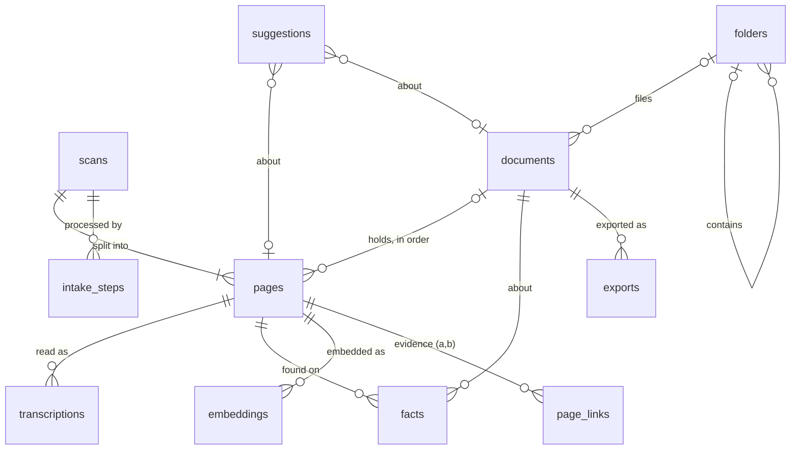

# Lindley database design

Schema version 5. The source of truth is [backend/src/lindley/db/schema.sql](../backend/src/lindley/db/schema.sql).
This document explains why the schema is shaped the way it is.

## Goals

1. **Intake keeps everything that could help match pages.** Each incoming file is squeezed for every clue it holds: what the file says about itself, what the image looks like, what the text says. All of it is kept with its source and confidence.
2. **Records fill in over time.** A document starts as a few pages and a guessed name. It gets closer to complete as pages are read, reviewed, dated and named. Completeness is worked out from the data, so it can never drift out of step.
3. **Nothing is destroyed.** Originals are never altered, and pages and readings are never deleted. A person's correction is added as a new reading.
4. **Every page is in one place.** A page is in the Inbox, in a document, or Set aside, and the database enforces it.
5. **Lindley suggests and people decide.** Anything Lindley proposes is stored as a suggestion, with its reasons, until a person accepts or dismisses it.

## Entities



| Table | One row per | Why it exists |
|---|---|---|
| `scans` | incoming file | Where the file came from, its hash (to catch duplicates), EXIF data and import mode. A multi-page PDF or TIFF is one scan. |
| `pages` | page image | The unit people move around. Holds the image measurements and where the page lives (a document and position, Set aside, or neither, which means the Inbox). |
| `transcriptions` | reading of a page | Every reading from Tesseract, the vision model, or a person's correction. Exactly one is current. `confirmed_at` records that a person checked it. |
| `facts` | thing found | Dates, names, places, letterheads and so on, each with a source, a confidence, and its position on the page. Belongs to a page or to a document. |
| `embeddings` | page and model | A text vector for "related pages" and similarity matching. |
| `page_links` | page pair and relation | Evidence that two pages belong together, such as "continues", "same paper", or "adjacent file". |
| `documents` | document | Name (and whether a person chose it), status, folder, type, date, grouping confidence, summary. |
| `folders` | folder | The user's folder tree. |
| `suggestions` | proposal | "Add to document", "reorder", "name", "complete", and so on, with reasons shown in the UI. |
| `exports` | PDF made | When a document was exported, where to, and which pages were in it. |
| `intake_steps` | step run | Progress, errors, and the extractor version for each step, so a step can be re-run later. |
| `history` | action | Who did what (a person or Lindley), with before and after. A person's decision is one `batch` of rows, undone together. Used for undo and the audit trail. |
| `duplicates` | page pair | Two pages that look like the same page scanned again (`same_page`), or that have very similar text (`similar`), with the evidence and a person's decision. |
| `duplicate_checks`, `text_sketch` | page | Which reading each page was checked for duplicates with, and the page's text sketch for finding candidates. |
| `ai_calls` | call to an AI | Which connection, what for (reading a page, sorting pages), whether Lindley made it on its own or a person OKed it, and whether it worked. Keeps the daily and monthly limits and shows what was sent where. |
| `ai_answers` | question to an AI | The AI's reply about some pages, known by what it was shown, so the same question is never paid for twice. |
| `needs_ai` | question waiting for an AI | Pages the rules couldn't sort and the AI hasn't been asked about, with the rules' own guess at the documents in them. Refreshed each time the assembler runs. |

Settings stay in `settings.json`. API keys stay in Windows Credential Manager and never go in the database.

## What intake extracts

Each step writes an `intake_steps` row, so the UI can show "Reading…" and a failed step can be retried alone.

| Step | Reads | Writes |
|---|---|---|
| `hash` | the file | `scans.sha256`. A known hash is flagged as a duplicate rather than imported twice. |
| `exif` | file system, EXIF | file created and modified times, `scanner_make` and `scanner_model`, `scanned_at`, `exif_json`, and a `file` fact from the file name (`scan_0042` is a sequence number) |
| `split` | PDF or TIFF | one `pages` row per page, with `page_index` |
| `image` | the page image | size, DPI, colour mode, `phash`, `paper_color`, `blank_score`, `detected_rotation`, `script` (handwritten, printed, typed, mixed or none) |
| `ocr` | Tesseract | a `transcriptions` row with word boxes and confidence, and `language` |
| `vision` | vision model | a `transcriptions` row for handwriting and low-confidence pages. It becomes current if it's the better reading, but never replaces a person's text. With `vision_mode = ask` (the default), the step is first recorded as `queued` ("Waiting for you to OK the vision model") and runs only when a person sends the waiting pages (`Pipeline.read_waiting`). A failed call is never repeated on its own. |
| `facts` | current text, image | `facts` rows (see below) |
| `embed` | current text | an `embeddings` row |
| `match` | everything above | `page_links` evidence, then `suggestions` |

### The image step

`lindley.worker.image` looks at a reduced copy of each page with its edges cropped off, so dark
scanner borders and shadows don't count as writing. The thresholds are a first guess, to be tuned
on real scans.

- `blank_score` is how little ink there is, after dust specks are filtered out: 0 means a full
  page of writing and 1 means blank. At 0.97 or above, a page counts as blank. A blank page
  is still read by Tesseract, so it has a current reading, but it isn't sent to the vision model
  and the assembler only suggests setting it aside.
- `paper_color` is the mean colour of the background pixels.
- `phash` is a 64-bit difference hash. Hashes within 4 bits of each other are the same picture
  (a `duplicate` link). Near-empty pages all hash alike, so they're never compared.
- `detected_rotation` comes from Tesseract's orientation check: the degrees clockwise that turn the
  page upright. A confident answer is used as it is. An unsure one (confidence under 2) is only
  a guess, and on real scans it was as often wrong as right. So when a page reads poorly as
  scanned, it's also read turned the way Tesseract guessed, and the turn is kept only if that
  reads at least 10 points better. Pages with
  `detected_rotation + user_rotation` (or an EXIF orientation) are read from a turned copy in the
  processing folder, which is deleted afterwards. **Word boxes are therefore in upright
  coordinates.** `width_px` and `height_px` are the image as a viewer shows it (EXIF applied),
  before either rotation.
- `script` is set after reading, from Tesseract's confidence line by line. Lines under 50% look
  handwritten and lines at 75% or more look printed; typewriting on old paper often falls in
  between.
  - Mostly handwritten lines (70%) make a page `handwritten`.
  - A real share of both (20% each) makes it `mixed`, such as a typed page with handwritten
    corrections.
  - Otherwise, a page where at least 40% of lines clearly look printed is `printed`.
  - A blank page is `none`.
  - If Tesseract can't tell, it stays NULL. `typed` isn't told apart from `printed` yet.

The step runs once per page. A scan that's read again after a failure doesn't check its pages again.

### Kinds of fact

These are the starting kinds. New extractors add new kinds without a schema change.

| Kind | Example | Helps with |
|---|---|---|
| `date` | "March 4th 1892", normalized to `1892-03-04` | document date, ordering, matching |
| `person`, `place`, `organization` | "John Branson", "Xenia, O." | shared-name matching and search |
| `amount` | "3.50" | receipts and deeds |
| `salutation`, `closing`, `signature_name` | "Dear Sister,", "Your loving son", "Will" | where a letter starts and ends, and who wrote it |
| `letterhead`, `heading` | "XENIA FEED & SEED CO." | same-letterhead matching and document type |
| `page_marker` | "- 2 -" | page order |
| `first_line`, `last_line` | the opening and closing text | joining a sentence that runs from one page onto the next |
| `ink_color`, `stamp_seal` | "brown ink", "county seal" | same writer or sitting, and document type |
| `reference_number` | "Book 12, p. 340" | deeds and legal records |
| `document_type_hint` | "letter" | document type |

Each fact records `source` (file, exif, image, ocr, vision, rule or user), `source_detail` (the extractor and its version), `confidence`, `bbox` (so the UI can highlight it on the scan), and `status` (proposed, accepted or rejected). When a person corrects a fact, a new `user` fact is added and the old one is rejected. Nothing is overwritten.

## How matching works

```
facts, embeddings, image data  ->  page_links (evidence, one row per signal)
                               ->  suggestions (one proposal, with reasons)
                               ->  a person accepts or dismisses it  ->  history
```

- **Evidence is stored before any decision is made.** Every signal is stored in `page_links` separately, with a score and a readable `evidence` note, for example: "Page 2 ends mid-sentence ('…the auction in'); page 3 begins 'May, and Father…'".
- **The matcher combines the signals into one suggestion.** Its `reasons` are the plain-language list shown in the UI, for example "Same handwriting as page 2", "Mentions Mary and the auction in May".
- **Lindley's own groupings are ordinary rows.** When Lindley groups pages on its own (the italic, suggested names in the mockup), it creates a document with `origin = 'lindley'` and `name_source = 'lindley'`. Everything stays visible and can be undone through `history`.

## The assembler: from Inbox pages to documents

`lindley.assembler.assemble(conn, settings.assembler, chat)` runs once new scans have settled. It's safe to run as often as you like; a second run with nothing new changes nothing.

1. **Clues** (`clues.py`, rules only).
   - **Page numbers.** A number on a row of its own in the top or bottom 12% of the page ("- 2 -", "Page 2 of 3", "ii"). Specks and smudges on that row don't count against it, and OCR slips next to a real digit are read through ("1l" is 11). A number inside a sentence, or in a typesetter's note like "Indent 1 em", isn't one. A number read with doubt is marked unsure and counts for less. When every page of a document is numbered, a gap is reported: "Page 4 seems to be missing".
   - **Noise at the edges.** Lines of specks (the paper's edge, show-through, a hole punch) are dropped from the top and bottom before the first and last lines are taken, and so are stray marks before the first word. A scrap Tesseract read out of order goes back into the line it sits in.
   - greetings ("Dear Sister,"), letterheads, headings and bylines ("By Lindley C. Branson"), which start a document;
   - closings and signatures ("Your loving son / John"), "Paid" and "Notary Public", which end one;
   - sentences cut off at the bottom of a page and picked up at the top of the next;
   - dates in old spellings, people, places, amounts, and file sequence numbers (`scan_0042`);
   - whether a page looks like a letter, receipt, deed, diary, stray note or blank.

   All of these are saved as `facts` with `source = 'rule'`.
2. **Evidence** (`evidence.py`). Each pair of pages gets a same-document score from 0 to 1. Every piece of evidence is a named feature, and a small logistic model adds up their weights (`weights.py`, in log-odds) into the score:
   - scanned one after another; a greeting on the second page or a signature on the first; different kinds of page;
   - page numbers running n → n+1, close (a page swapped or missing) or far apart;
   - a sentence carried over the break, counted for less between pages not scanned together (in a typescript nearly every page ends mid-sentence);
   - the same letterhead, shared names, the same paper colour;
   - the **layout fingerprint** (`layout.py`): where lines start and end as a share of the page width, line spacing in character widths, and characters in a full line. It's free of the scan's size and resolution. Pages set out differently (a single-spaced letter, a page of 40-character notes) are kept apart;
   - **rare words** both pages use (`terms.py`, tf-idf), measured but not yet counted (see below). How rare a word is is measured over every page in the library, not only the Inbox;
   - a word hyphenated at the bottom of one page and finished at the top of the next. Tesseract often reads a typewriter's hyphen as "=", which counts too;
   - **what pages are about** (`meaning.py`), when the optional Model2Vec package is installed (`pip install lindley[embed]`): a static embedding model, `minishlab/potion-base-8M` (8 MB, numpy only, about 0.25 ms a page on a laptop CPU), turns each page into a vector, and pages whose vectors point the same way count as alike. The model is downloaded once; no text leaves the computer. Vectors are made afresh each run, which is quicker than keeping them current as pages are read again. On the 7 real typescripts it was weaker than rare words (a page's most-alike page was from its own document for 36 of 45 pages, against 39 for rare words), the fitted weight was −0.03, and counting it at 1.0 made the rules' proposals less precise (0.72 → 0.69). So it's measured but weighed at nothing, for weights learned from a person's own archive to take up if it helps there;
   - what the scanner saw: a pause of over ten minutes between two scans (the EXIF time, else the file's), sheets differing by more than half an inch, another resolution or colour mode, handwriting beside typing. These are measured but weighed at nothing until there are scans to set them by: the real scans so far were all scanned alike, and pauses fall mid-document as often as between documents (one archive's 178 scans took 45–90 seconds a page, and many pauses of 2–25 minutes came before a page that starts mid-sentence).

   A reason is shown to a person only when its evidence counts towards the pages going together. Each is saved in `page_links` with a readable note (`same_writer` for layout, `similar_text` for shared words).
3. **Grouping** (`segment.py`). Each page is linked to the page that follows it, and the chains of links are the documents: each page has at most one page after it and one before, and there are no loops (a path cover).
   - **Scan order first.** Neighbours in scan order are linked wherever they score 0.5 or more. Scan order is the strongest single hint.
   - **Then loose ends, over the whole Inbox, best first.** A chain that doesn't end is joined to one that doesn't start when one clearly continues the other (0.75; 0.6 for two pages fed through the scanner the wrong way round), and no other loose end comes within 0.1 of it, for either page. Without that last rule, page 3 of one typescript was joined to page 4 of another: typescripts by one author share page numbers, and nearly every page ends mid-sentence.
   - **Order within a group:** page numbers first, then greeting first and signature last, then the chain. The order counts as settled, so the AI isn't asked about it, when every link in the chain scores 0.7 or more.
   - **Confidence:** each group gets one (0–100), based on how sure the breaks inside and around it are. It drops when the group has no clear start or end (a page may be missing), except for diaries.
4. **A person, then the AI** (`ai.py`). What the rules can't settle goes to a person as hints in the Inbox: an answer costs nothing and is right. The AI is the last resort, asked only about breaks scoring 35–75 and groups whose order isn't settled, and only:
   - on its own, when its connection's `allow` is `auto` and its limits aren't used up (`auto.py`), as the pages arrive, or once they've waited `ask_ai_after_days` for a person to answer first (default 0). Pages whose "Do these go together?" a person dismissed aren't sent on their own. Naming new documents follows the same rule.
   - when a person sends them from **Needs AI** (below), or asks about some pages (`POST /api/assembler/ask`): asking is the OK, and those pages are sent at once.

   It gets page text and clues, never images.
   - Its reply must use every page given exactly once, and no others. Anything else is rejected and the rules' answer stands.
   - It also suggests names where the rules could only guess.
   - **Every reply is kept** (`answers.py`, table `ai_answers`), known by what the AI was shown: the pages' ids, text and clues, and the instructions. The rules' proposal is left out, since it shifts as new scans arrive beside the pages. Pages the AI looked at but that still wait in the Inbox are answered from that reply on later runs, with no call, even when the AI may not be called now. A reply that was rejected is kept too; a call that failed isn't. Change a page's reading and it's a new question.
5. **Saving** (`apply.py`), in one transaction:

   | Situation | What Lindley does |
   |---|---|
   | The group clearly continues an open document that Lindley made and no one has touched | Adds the pages to it (`history`: `add_pages`) |
   | The same, but a person has named, changed or worked on the document | Suggests it (`add_to_document`); the page stays in the Inbox |
   | The group is confident (at or above `group_at`, default 75) | Creates a Lindley document with an italic name, its type, date, confidence and `reasons` (`history`: `group_pages`) |
   | A likely match (at or above `hint_at`, default 45) | Suggests it (`add_to_document`); the page stays in the Inbox |
   | Pages that may be one document (two or more, at or above `hint_at`) | Asks "Do these go together?" (`group_pages`, with the pages in order, a name, type and date) |
   | A blank page or stray note | Suggests Set aside; never moves it |
   | A completed document | Never touches it |
   | A suggestion a person dismissed | Never makes it again |

**Needs AI** (`api/needs_ai.py`, `GET /api/needs-ai`). Every scan waiting for an AI, in two kinds, like the two kinds of Duplicates:
- **Hard to read.** Pages Tesseract read with less than `ocr.confidence_threshold` (70), waiting for the vision model as a queued `vision` step, or whose vision call failed. Their Tesseract reading is used meanwhile. `POST /api/needs-ai/read` sends some or all of them (failed ones too), then sorts the Inbox again with the new text.
- **Hard to sort.** Each question the sorting AI would be asked that it hasn't been (`needs_ai`), with the rules' own guess at the documents in it and how sure they are. `POST /api/needs-ai/{id}/sort` sends one, `POST /api/needs-ai/sort` all. Once the AI has looked at pages, they leave the list even if its answer was turned down: they're the person's to sort then.

The list also says which connection would be used, where it runs (local or cloud) and whether it may run on its own. When it may, Lindley sends these itself as they arrive, within its limits (the watcher, through `auto.py`, sends hard pages that waited while it had to ask), so the list is usually empty. Calls a person sends are recorded as theirs, never counted against the limits.

**Learning from people** (`relearn.py`, table `learned_weights`). A person's answers are free labels. Every document a person made, accepted, finished or worked on (and every assembled PDF read in) is an answer: these pages, in this order. Every two-page "Do these go together?" a person turned down says those two don't. Once there are 10 answer documents, and 5 more than at the last try, the watcher fits the weights again after a settle (about 10 seconds for 7 documents). Fitting alone isn't trusted, since fitted weights have predicted pairs better yet built worse documents. So the answer documents are split in two, and weights fitted to one half rebuild the other half's documents, fed in as loose scans in order and with neighbours swapped, against the weights in use. They're adopted only if, both ways round, they make no more wrong documents, rebuild no fewer exactly, and do better somewhere. Every try is kept; the latest adopted weights are used, else the shipped ones. On the 7 real typescripts, weights fitted to half of them rebuilt one document fewer of the other half, so they'd be turned down.

**A person's answers** (`decide.py`, `GET /api/suggestions`, `POST /api/suggestions/{id}/accept` and `/dismiss`).
- **Accept "Do these go together?"**: the pages become a document, which counts as the person's own (`origin = 'user'`), so Lindley only suggests changes to it from then on.
- **Accept "Add to …?"**: every page hinted together goes to the start or end of the document, as hinted. Pages already there move down to make room when the new ones go first.
- **Accept "Set aside?"**: the page is set aside.
- Each is one `history` batch, returned as `undo`. Undoing a grouping removes the document it made, unless pages were added to it or it was exported since. A hint whose pages have moved since is refused as out of date.
- **Dismiss**: the hint is never made again, and the AI isn't sent those pages on its own.

**Test bench.** `lindley.assembler.bench` makes seeded batches of believable pages with known right answers:
- letters of 1–4 pages, some with page numbers and some broken mid-sentence;
- receipts, a 3-page deed, diary pages, notes and blanks;
- two pages swapped, and a last page that arrives in a later drop.

`scripts/bench_assembler.py` scores the assembler on them, and `scripts/demo_assembler.py` shows the Inbox shrinking round by round. Results at version 1, over 30 batches:

| | Pair F1 | Documents made | Wrong | Rebuilt exactly | Left in Inbox |
|---|---|---|---|---|---|
| Rules only | 0.94 | 240 | 0 | 96% | 4.5% |
| Rules + stand-in AI that is always right | 0.97 | 249 | 0 | 96% | 0.3% |

The rules were written knowing what the bench generates, so these numbers are a ceiling, not a forecast. The bench's job is to catch regressions and to measure a real model (`--ai settings`).

**Real scans.** `scripts/bench_assembler.py --real lindley.db` uses assembled PDFs as the answer key: each PDF read into a Lindley database is one document, in its page order. Its pages are fed back in as loose scans under made-up names: in reading order, with neighbours swapped here and there, or shuffled. With 7 typescripts (45 pages) by one author, all typed alike, the rules' proposals before any confidence threshold score:

| Pages fed in | Pair F1 before | Pair F1 now | Rebuilt exactly now |
|---|---|---|---|
| In order | 0.70 | 0.79 | 63% |
| Some swapped | 0.68 | 0.77 | 53% |
| Shuffled | 0.19 | 0.16 | 1% |

Almost none of it becomes a document yet. A group of pages that's no kind the rules know (letter, receipt, deed, diary) can't reach `group_at`, so typescripts stay in the Inbox. Shuffled pages have little to go on but page numbers, which few of these pages show.

**What's left for the AI.** Paid AI should be the last resort, so the bench also counts what the rules leave for it: the windows `ai.refine` would be asked about, and their pages, whether or not an AI is connected (`RunReport.ai_windows`, `ai_pages`). Every change to the assembler should lower these without building fewer documents right.

| Bench | Pages fed in | Pages left for the AI: at first | linking chains |
|---|---|---|---|
| Made-up, 30 batches | 603 | 242 (88 windows) | 204 (73) |
| Real, in order, 10 runs | 450 | 440 (57) | 440 (57) |
| Real, some swapped | 450 | 435 (54) | 435 (54) |
| Real, shuffled | 450 | 393 (61) | 392 (59) |

**Fitting the weights.** `scripts/fit_assembler.py` fits the weights to made-up batches and real PDFs (`learn.py`: Newton steps on the L2-penalised log-loss, in plain Python), and tests each real document left out in turn. Fitted weights predicted single pairs much better (89% right on documents left out, against 65%) but built worse documents on both benches, so the shipped weights are hand-set and checked on both. Shared rare words stay at 0: in the made-up batches, whose letters share one pool of sentences, they joined a late page to the wrong letter. With more labelled documents (for example, documents people confirm), fitting is the way to set them.

**Fitting a group's confidence.** `scripts/fit_confidence.py` fits the chance that a group the rules propose is exactly one document, from its weakest link inside, the strongest link across its ends, whether it has a clear start and end, its kind, page numbers and length (`segment.GROUP_FEATURES`, 9 weights). Tested on real documents it hadn't seen, it was worse than the hand-made rule:

| Real groups, each document left out in turn | Log-loss | Documents made at 75 | Wrong |
|---|---|---|---|
| Hand-made rule | 0.56 | 13 | 2 |
| Fitted | 0.99 | 42 | 23 |

Seven documents are too few to fit even that, so `GROUP_WEIGHTS` is empty and the hand-made rule stands. The weakest link inside a typescript (scanned next, ends mid-sentence) honestly scores about 0.7, and about three in ten such links on these scans really are breaks, so a typescript's confidence near 60 isn't too low. Those pages need a person's answer, or the AI.

## Duplicates

The same page is often scanned more than once, sometimes with different settings: another dpi, colour or grey, a different exposure, more or less margin. That changes every pixel and the file's hash, but not the words. So duplicates are found by their text (`lindley.duplicates.detect`), checked before the assembler runs:

1. **Candidates.** Text is reduced to its letters (a–z). Each page keeps the hashes of its 64 smallest letter 8-grams in `text_sketch`. Pages sharing at least 4 of them are compared in full, so there is no all-pairs comparison.
2. **Confirmation.** For each candidate, three measures: how many letter 8-grams the texts share (J), how much of the shorter text is in the longer (C), and how many words match in order (R).
   - `same_page`: J ≥ 0.30 or R ≥ 0.60, and the texts are about as long (the shorter at least 0.85 of the longer).
   - `similar`: as alike as that but of quite different lengths (a sheet and a piece of it, or a page and a longer version), or J ≥ 0.15, or C ≥ 0.30.
   - Both pages need at least 200 letters.
   - OCR errors on old paper keep J well below 1 even for the same page, so the bars are modest; unrelated pages share almost nothing.
   - On 178 real typewritten scans:
     - re-scans had J 0.35–0.59, R 0.64–0.83 and length ratios of 0.96 or more
     - a page and part of it, or a longer version, had length ratios of 0.48–0.77
     - drafts and pasted-up pages sharing paragraphs had C 0.30–0.45
     - unrelated pages had C 0.21 at most
     - checking all 178 pages took 11 seconds
3. **Little text.** Notes, drawings and unread handwriting are compared by a small picture of their contents instead (`worker.image.image_signature`: grey, contrast evened out, cropped to the ink, 32×32). A match at 0.90 correlation or above is only ever `similar`.

Blank pages are never compared, and copies already set aside as duplicates are left out. A page is checked again whenever its current reading changes, such as after a vision reading or a person's correction.

Duplicates is a queue to work through, like Needs your review, not a place. The pages stay where they are, but the assembler never puts two copies of a page in one document, and never adds a page to a document that already holds its copy. So a document scanned twice becomes two documents, which the queue shows as a pair.

**Deciding** (`lindley.duplicates.resolve`). Open pairs that share a page form a set. Sets whose copies all lie in the same two documents form a document pair.
- **Suggestion.** Lindley suggests a copy and says why, in this order: text a person checked, the clearer reading, the bigger scan, colour. Where a copy already is only breaks ties. For very similar text (drafts), the UI suggests keeping both.
- **Keep one.** The kept scan takes the best place any copy had: a document position, else the Inbox. The other copies are set aside, marked as duplicates of it. Gaps in documents close up, and a document left with no pages is removed.
- **Keep a document.** Does that for every set the two documents share. Pages only the other document has stay where they are.
- **Not duplicates.** The pairs are never raised again.

Every change is written to `history` with its before and after, one batch per decision. That includes the pages that move up when a gap closes, and the open suggestions of a document that's removed.

**Undo** (`lindley.history.undo`, `POST /api/undo` for the latest decision or `POST /api/undo/{batch}` for a given one). It replays a batch backwards, putting each page, duplicate pair and removed document back as it was. It only does so if nothing has changed since: each target must still look the way the decision left it. If a page has moved again, the undo is refused with a reason and nothing is changed. Each decision's API response includes its batch as `undo`.

## Completeness

`lindley.db.progress.document_progress(conn, doc_id, review_below)` works out a checklist every time it's asked. Nothing is stored.

| Check | Done when |
|---|---|
| Has pages | the document holds at least one page |
| Every page read | every page's scan is read and has a current reading |
| Nothing waiting for review | no current reading is below the review threshold without being corrected or confirmed by a person |
| Named | `name_source = 'user'`, meaning a person chose or accepted the name |
| Date known | `doc_date` is set (partial dates like `1892-03` count) |
| Type known | `doc_type` is set |
| Page order settled | no open `reorder` suggestion |
| Exported | an `exports` row exists |

`ready` means everything except the export is done. That drives the mockup's banner, "Lindley thinks this document is complete." The review threshold comes from settings, so it's passed in rather than stored. Changing the threshold changes the checklist straight away.

## The Details tab (future UI round)

The Details tab reads directly from this data:

- **Page:** file and scanner information (`scans`), image measurements (`pages`), every reading with its source and confidence (`transcriptions`), and facts grouped by kind, each with a "found by" label and a highlight on the scan.
- **Document:** the completeness checklist, document facts, the evidence that holds the pages together (`page_links` between its pages), open suggestions with their reasons, and export history.

## Rules the schema enforces

- A page can't be both in a document and Set aside. A page in a document must have a position.
- A document that still holds pages can't be deleted, and neither can pages, readings or scans. Foreign keys have no cascade.
- Each page has at most one current reading (a partial unique index).
- A fact belongs to exactly one page or one document.
- A page link is stored once per pair, relation and source, with the smaller page id first.
- A duplicate pair is stored once, with the smaller page id first, so a pair a person decided on is never raised again.
- Searches go through `transcriptions_fts` joined on `is_current = 1`, so old readings aren't matched but are kept.

## Versioning

`PRAGMA user_version` holds the schema version (`SCHEMA_VERSION` in `database.py`). New databases are built from `schema.sql`. Existing ones run the numbered `MIGRATIONS` in order. A database from before version 1 (the placeholder tables) is rebuilt if it's empty, and refused with an explanation if it has data.

## Ask Lindley's view of the data

The AI gets read-only access through views, currently `v_page_location` and `v_current_text`, plus tools built on them. It never writes. Anything it wants to change becomes a suggestion for a person to decide.
